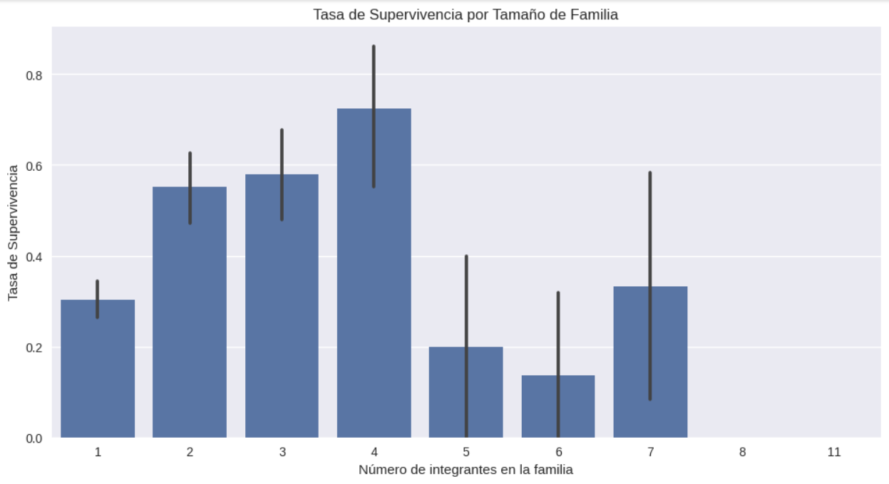
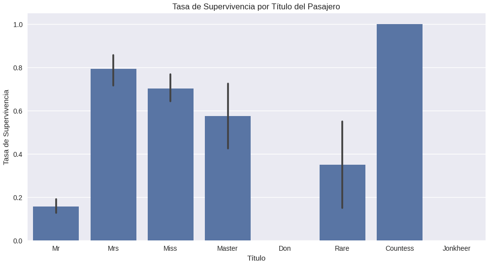
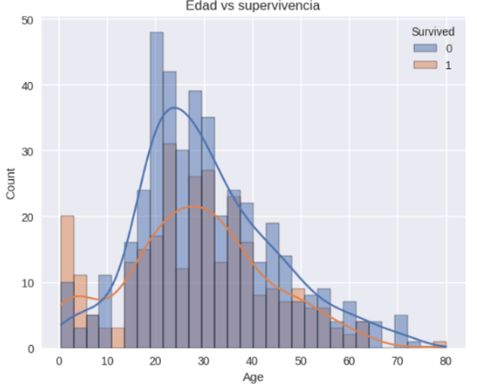
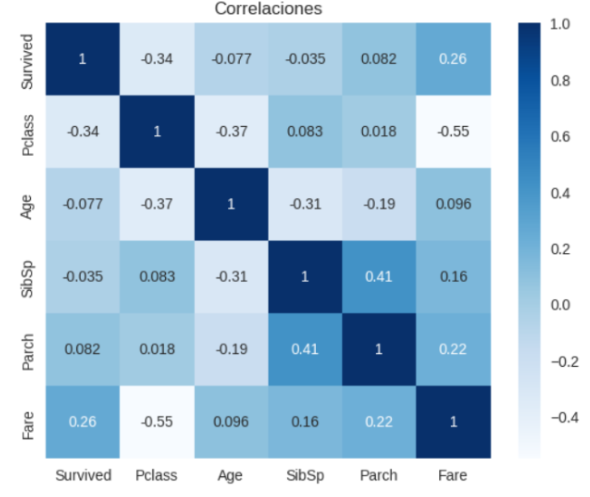
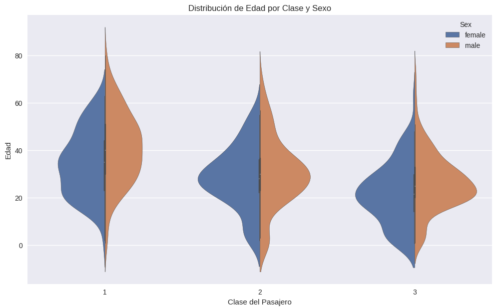

# Práctica 1: Análisis Exploratorio del Dataset del Titanic

Análisis inicial del famoso dataset de Kaggle para descubrir los factores que influyeron en la supervivencia de los pasajeros.

## Contexto
Esta práctica es una introducción clásica al análisis de datos y machine learning. Se utiliza el dataset del Titanic para realizar un **Análisis Exploratorio de Datos (EDA)**, que consiste en investigar el conjunto de datos para descubrir patrones, detectar anomalías y probar hipótesis iniciales con la ayuda de estadísticas y visualizaciones.

## Objetivos
- Identificar las variables más influyentes en la supervivencia de los pasajeros.
- Evaluar la calidad de los datos, identificando columnas con valores faltantes.
- Generar visualizaciones clave para comunicar los hallazos de forma efectiva.

## Actividades (con tiempos estimados)

| Actividad | Tiempo | Resultado Esperado |
| :--- | :---: | :--- |
| **Investigación del Dataset** | 10 min | Comprensión de variables y objetivo. |
| **Configuración del Entorno** | 5 min | Notebook listo con librerías y datos. |
| **Análisis Descriptivo** | 10 min | Resumen estadístico y conteo de nulos. |
| **Análisis Visual (EDA)** | 15 min | Gráficos de patrones de supervivencia. |
| **Documentación** | 15 min | Resumen de hallazgos en el portafolio. |

## Desarrollo
El análisis se realizó en un notebook de Google Colab utilizando **Pandas** para la manipulación de datos y **Seaborn/Matplotlib** para la visualización.

El proceso comenzó con la carga de datos directamente desde Kaggle. La inspección inicial (`.info()`, `.describe()`) reveló rápidamente que las columnas **`Age`** y **`Cabin`** tenían una cantidad significativa de valores faltantes, lo cual es un desafío clave para el preprocesamiento futuro.

Posteriormente, se crearon visualizaciones para explorar hipótesis. Se generaron gráficos que cruzaban la variable objetivo `Survived` con otras características como `Sex`, `Pclass` y nuevas variables creadas como `FamilySize` y `Title`, las cuales ayudaron a descubrir patrones más profundos en los datos.

## Evidencias

Los hallazgos visuales más importantes se resumen en los siguientes gráficos, que van desde análisis de variables directas hasta la exploración de características creadas artificialmente (`FamilySize`, `Title`).

???+ info "Gráfico 1: Tasa de Supervivencia por Tamaño de Familia"

    Se creó una nueva variable `FamilySize` para analizar su impacto. Los resultados muestran que las personas en familias de 2 a 4 miembros tuvieron la mayor probabilidad de sobrevivir, mientras que quienes viajaban solos o en familias muy grandes tuvieron menos suerte.

    { width="500" }

???+ info "Gráfico 2: Tasa de Supervivencia por Título del Pasajero"

    Extraer el título (`Mr`, `Mrs`, `Master`, etc.) del nombre de cada pasajero reveló ser una de las estrategias de **ingeniería de características** más efectivas. El título `Master` (niños varones) y los títulos femeninos (`Mrs`, `Miss`) tuvieron una altísima tasa de supervivencia, mientras que `Mr` tuvo la más baja.

    { width="500" }

???+ info "Gráfico 3: Distribución de Edad vs Supervivencia"

    Este histograma muestra la distribución de edades para sobrevivientes y no sobrevivientes. Se observa un pico claro de supervivencia en niños pequeños (menores de 10 años) y una alta mortalidad en el rango de adultos jóvenes (20-40 años).

    { width="500" }

???+ info "Gráfico 4: Matriz de Correlaciones Numéricas"

    El mapa de calor muestra la correlación lineal entre las variables numéricas. Se destaca la correlación negativa entre `Pclass` y `Fare` (-0.55), lo cual es lógico (a menor número de clase, mayor tarifa). También se observa que `Fare` tiene la correlación positiva más alta con `Survived` (0.26).

    { width="500" }

???+ info "Gráfico 5: Distribución de Edad por Clase y Sexo"

    Este gráfico de violín ofrece una vista detallada de cómo se distribuye la edad entre hombres y mujeres dentro de cada clase. Permite observar, por ejemplo, que la edad promedio de los hombres de primera clase era mayor que en las otras clases y que la distribución de edades en tercera clase era considerablemente más joven en general.

    { width="500" }

## Reflexión
- **Qué aprendí:** Comprendí que el EDA es un paso indispensable antes de entrenar cualquier modelo. Las visualizaciones son increíblemente efectivas para contar una historia con los datos y descubrir patrones que no son obvios en una tabla.
- **Qué mejorarías:** Para un análisis futuro, aplicaría una estrategia de imputación de datos más robusta para la edad, rellenando los valores faltantes con la mediana de edad según la clase y el sexo del pasajero.
- **Próximos Pasos:** El siguiente paso lógico es el **preprocesamiento de datos**: manejar los valores faltantes, convertir variables categóricas a numéricas y preparar el dataset para entrenar un modelo de clasificación predictivo.
