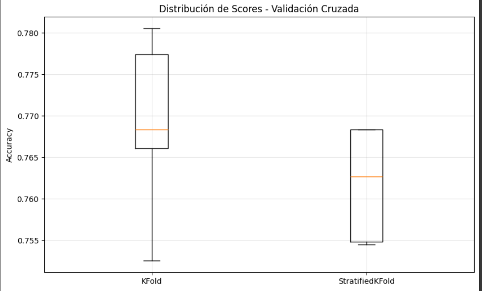
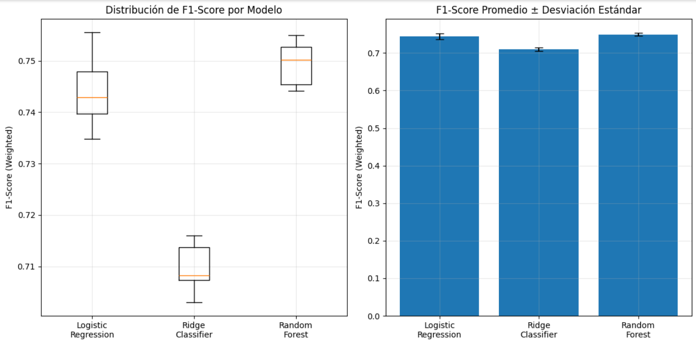
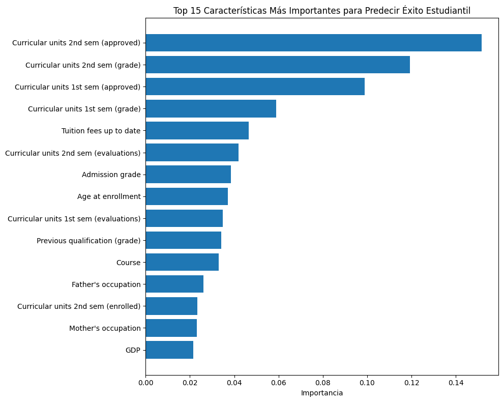

# Práctica 5: Validación y Selección de Modelos

En esta práctica, se aplicaron técnicas de validación robusta y comparación sistemática de modelos para predecir el éxito académico estudiantil.

## Contexto
El objetivo de esta actividad fue identificar a estudiantes en riesgo de abandono utilizando el dataset "Student Dropout and Academic Success" del repositorio de UCI. A diferencia de prácticas anteriores, el foco principal no fue solo construir un modelo, sino asegurarse de que su evaluación sea robusta y de que el algoritmo seleccionado sea el más adecuado entre varias alternativas. Para ello, se utilizaron `Pipelines` para prevenir la fuga de datos (*data leakage*) y `Validación Cruzada Estratificada` para obtener una medida de rendimiento estable.

## Objetivos
- Implementar `Pipelines` de `scikit-learn` para encapsular el preprocesamiento y el modelado.
- Comparar la estabilidad de la validación cruzada con `KFold` vs. `StratifiedKFold`.
- Evaluar y comparar sistemáticamente el rendimiento de tres modelos de clasificación: `Logistic Regression`, `Ridge Classifier` y `Random Forest`.
- Optimizar los hiperparámetros del mejor modelo utilizando `GridSearchCV` y `RandomizedSearchCV`.
- Analizar la explicabilidad del modelo final para obtener insights accionables.

## Actividades (con tiempos estimados)

| Actividad | Tiempo | Resultado Esperado |
| :--- | :---: | :--- |
| **Carga y Exploración de Datos** | 10 min | Comprensión del dataset y sus características. |
| **Validación Cruzada** | 15 min | Comparación de estabilidad entre KFold y StratifiedKFold. |
| **Comparación de Modelos** | 15 min | Selección del mejor algoritmo basado en F1-Score promedio. |
| **Optimización de Hiperparámetros** | 10 min | Modelo final afinado con los mejores parámetros. |
| **Análisis de Explicabilidad** | 10 min | Identificación de las características más influyentes. |

## Desarrollo
El proceso se centró en un flujo de trabajo de Machine Learning robusto y comparable.

1.  **Exploración:** Se cargó el dataset y se confirmó que la variable objetivo ("Target") estaba desbalanceada, con una mayoría de estudiantes "Graduados" (49.9%). Esto justificó el uso de `StratifiedKFold` y la métrica `f1_weighted` para una evaluación justa.
2.  **Validación:** Se comparó `KFold` con `StratifiedKFold` usando un pipeline simple de `StandardScaler` y `LogisticRegression`. Como se esperaba, **`StratifiedKFold` resultó ser más estable** (menor desviación estándar en los scores), por lo que se adoptó para el resto de la práctica.
3.  **Selección de Modelo:** Se realizó un "torneo" entre `Logistic Regression`, `Ridge Classifier` y `Random Forest`. El modelo **`Random Forest` fue el claro ganador**, obteniendo el F1-Score promedio más alto (~0.7494).
4.  **Optimización:** Se afinaron los hiperparámetros del `Random Forest` usando `GridSearchCV` y `RandomizedSearchCV`. Ambos métodos encontraron una configuración óptima que mejoró el F1-Score a **~0.7629**.
5.  **Explicabilidad:** Finalmente, se analizó la importancia de las características del modelo optimizado. Los resultados mostraron que las variables académicas, especialmente las **unidades curriculares aprobadas en el segundo semestre**, son los predictores más fuertes del éxito estudiantil.

## Evidencias
Los resultados clave del notebook se resumen en las siguientes visualizaciones y métricas.

???+ info "Evidencia 1: Comparación de Estabilidad de la Validación Cruzada"

    La validación cruzada estratificada (`StratifiedKFold`) mostró una menor dispersión en los scores de accuracy en comparación con `KFold`, confirmando que es la opción más estable y confiable para este dataset desbalanceado.

    - **Resultado KFold:** 0.7690 ± 0.0098
    - **Resultado StratifiedKFold:** 0.7618 ± 0.0061
    
    { width="500" }

???+ info "Evidencia 2: Comparación de Rendimiento de Modelos"

    En la competencia de modelos evaluados con F1-Score (ponderado), `Random Forest` superó a los modelos lineales, demostrando su capacidad para capturar relaciones más complejas en los datos.

    - **Random Forest:** 0.7494 ± 0.0041
    - **Logistic Regression:** 0.7442 ± 0.0071
    - **Ridge Classifier:** 0.7096 ± 0.0047

    { width="600" }

???+ info "Evidencia 3: Importancia de las Características"

    El análisis del modelo final `Random Forest` reveló que el rendimiento académico es, por lejos, el factor más importante. Las variables más predictivas fueron:

    1.  **Curricular units 2nd sem (approved):** 0.1516
    2.  **Curricular units 2nd sem (grade):** 0.1193
    3.  **Curricular units 1st sem (approved):** 0.0987

    { width="500" }

## Reflexión
- **Qué aprendí:** Esta práctica consolidó la importancia de un proceso de validación riguroso. Aprendí que usar `Pipeline` no es solo una buena práctica, sino una necesidad para evitar el *data leakage*. La comparación sistemática de modelos y la posterior optimización de hiperparámetros es un flujo de trabajo estándar para maximizar el rendimiento de forma controlada.
- **Qué mejorarías:** El análisis de explicabilidad reveló que el rendimiento del segundo semestre es muy predictivo. Esto podría ser un "spoiler" si el objetivo es intervenir tempranamente. Un enfoque mejorado sería entrenar el modelo utilizando únicamente datos disponibles al final del primer semestre para crear una herramienta de predicción verdaderamente proactiva.
- **Próximos Pasos:** El siguiente paso sería validar el modelo final con un conjunto de datos completamente nuevo (si estuviera disponible) y, si el rendimiento se mantiene, trabajar en su despliegue para que la institución pueda utilizarlo. Además, se podrían explorar las "reglas de decisión" de los árboles individuales del Random Forest para entender combinaciones específicas de factores que llevan al abandono.

## Referencias
- **Dataset:** [Student Performance Data Set (UCI)](https://archive.ics.uci.edu/dataset/697/student+performance)
- **Notebook de Análisis:** [Práctica 5 - Validación y Selección de Modelos](https://colab.research.google.com/drive/1HfgyZo1c8WLolZEJ8l71tud12Q6JPtXo?usp=sharing)
