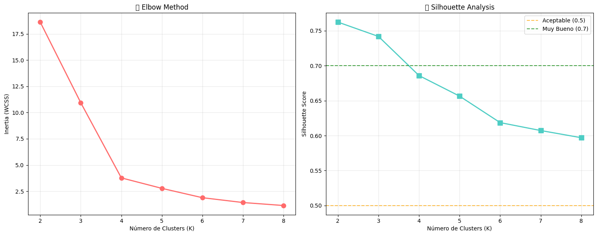
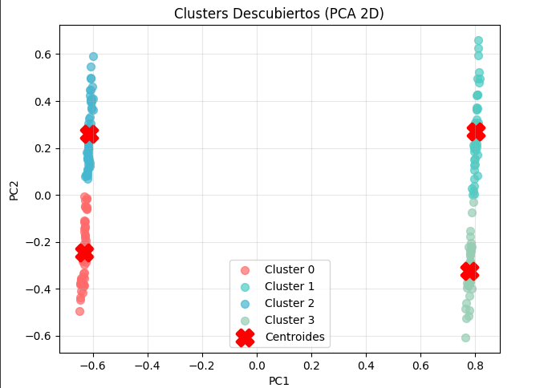
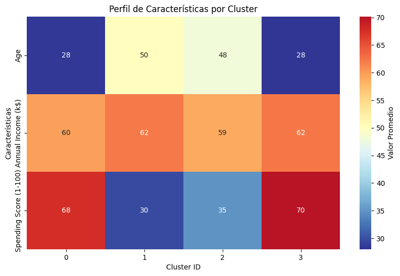
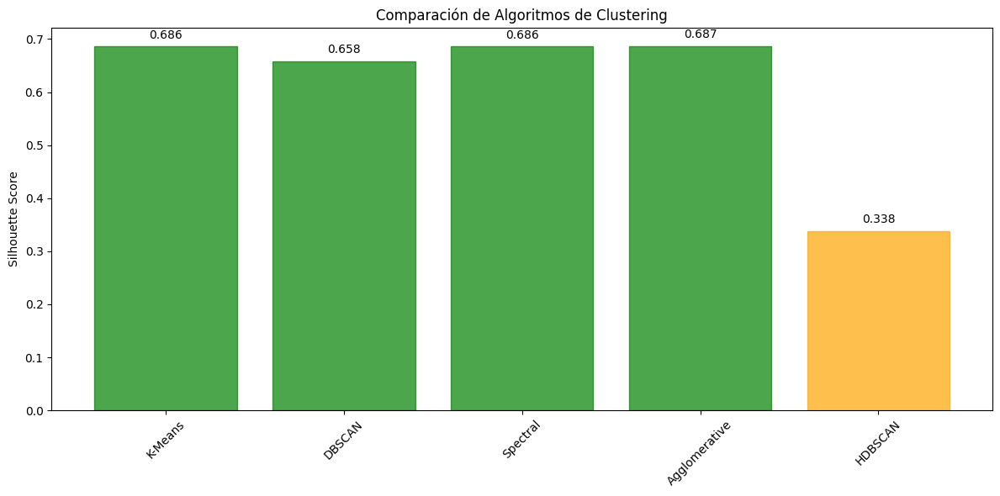

# Descubriendo patrones de clientes: segmentación con Clustering y PCA

En este proyecto, se aplicaron técnicas de aprendizaje no supervisado para segmentar a los clientes de un centro comercial, con el objetivo de generar insights para estrategias de marketing personalizadas.

## Contexto
El objetivo fue analizar el dataset "Mall Customer Segmentation" para descubrir grupos naturales de clientes basándose en su comportamiento y características demográficas. Se implementó un flujo de trabajo completo que incluyó la preparación de datos, la comparación de técnicas de normalización, la selección y reducción de características, y la evaluación de múltiples algoritmos de clustering para encontrar la mejor segmentación posible.

## Objetivos
- Aplicar y comparar tres técnicas de normalización de datos (`MinMaxScaler`, `StandardScaler`, `RobustScaler`).
- Evaluar y comparar métodos de manejo de características: PCA vs. Selección Secuencial de Características (Forward/Backward).
- Determinar el número óptimo de clusters (K) para K-Means utilizando el Método del Codo y el Análisis de Silueta.
- Entrenar y comparar el rendimiento de múltiples algoritmos de clustering (K-Means, DBSCAN, HDBSCAN, etc.).
- Interpretar los segmentos finales para crear perfiles de cliente accionables para el negocio.

## Actividades (con tiempos estimados)

| Actividad | Tiempo | Resultado Esperado |
| :--- | :---: | :--- |
| **Exploración de Datos (EDA)** | 20 min | Comprensión de variables y sus distribuciones. |
| **Preparación y Selección de Features**| 30 min | Dataset preprocesado y elección del mejor método (PCA/Feature Selection). |
| **Modelado y Búsqueda de K** | 20 min | Entrenamiento del modelo final con el número óptimo de clusters. |
| **Evaluación e Interpretación** | 15 min | Perfiles de cliente definidos y visualizaciones generadas. |

## Desarrollo
El análisis comenzó con una exploración de los datos, que reveló que las variables tenían escalas muy diferentes, haciendo crítica la etapa de normalización. Se realizó una "batalla de scalers", donde se aplicó clustering K-Means a tres versiones normalizadas de los datos, eligiendo la que produjo el mayor Silhouette Score.

Posteriormente, se compararon diferentes enfoques para el manejo de características: usar todas las variables (baseline), reducirlas a 2 componentes con PCA y seleccionar las 3 mejores con Selección Secuencial. Se concluyó que reducir la dimensionalidad mejoraba significativamente el rendimiento.

Finalmente, se determinó el número óptimo de clusters (K) mediante el Método del Codo y el Análisis de Silueta, y se entrenó el modelo K-Means final. Adicionalmente, se exploraron otros algoritmos como DBSCAN y HDBSCAN para comparar los resultados y obtener una visión más completa de la estructura de los datos.

## Evidencias
Los resultados visuales y numéricos demostraron la existencia de grupos de clientes claros y bien definidos.

???+ info "Evidencia 1: Búsqueda del Número Óptimo de Clusters (K)"

    El Método del Codo y el Análisis de Silueta se utilizaron para determinar el número óptimo de clusters. El gráfico de silueta generalmente ofrece una respuesta más clara, mostrando un pico en el valor de K que representa el mejor balance entre cohesión y separación de los grupos.

    
    { width="600" }

???+ info "Evidencia 2: Visualización de Clusters Finales con PCA"

    La reducción de dimensionalidad con PCA permitió visualizar los segmentos en un gráfico de 2D. Se pueden observar grupos de clientes compactos y bien separados, confirmando la validez de la segmentación.

    
    { width="500" }

???+ info "Evidencia 3: Perfil Promedio de los Clusters"

    El mapa de calor resume las características promedio de cada segmento. Este gráfico es clave para la interpretación de negocio, ya que permite identificar rápidamente el perfil de cada grupo (ej. Cluster X: Ingreso alto, Gasto alto).

    
    { width="500" }

???+ info "Evidencia 4: Comparación Final de Algoritmos"

    Se realizó un benchmark comparando el rendimiento (Silhouette Score) de múltiples algoritmos. K-Means, Spectral y Agglomerative Clustering obtuvieron los mejores resultados, demostrando ser muy efectivos para este dataset.

    { width="600" }

## Reflexión
- **Qué aprendí:** Aprendí la importancia crítica de la normalización de datos para algoritmos basados en distancia y cómo evaluar diferentes técnicas de preprocesamiento de forma sistemática. Comprendí el valor de PCA no solo para reducir dimensiones, sino también como una herramienta de visualización indispensable. Finalmente, la comparación de múltiples algoritmos me enseñó que no hay una única solución, y que cada uno puede revelar diferentes aspectos de la estructura de los datos.
- **Qué mejorarías:** Para un análisis más profundo, se podría experimentar con algoritmos no paramétricos como HDBSCAN con diferentes parámetros para ver si revelan sub-segmentos más finos. También se podría realizar una ingeniería de características más compleja, creando variables compuestas que podrían mejorar la separación de los grupos.
- **Próximos Pasos:** El siguiente paso sería presentar estos perfiles al equipo de marketing para darles nombres o "arquetipos" (ej. "VIPs", "Ahorradores", "Jóvenes Impulsivos"). A partir de ahí, se podrían diseñar y lanzar campañas de marketing específicas para cada segmento y medir su impacto en las ventas.

## Referencias
- **Dataset:** [Mall Customer Segmentation Dataset (Kaggle)](https://www.kaggle.com/datasets/vjchoudhary7/customer-segmentation-tutorial-in-python)
- **Notebook de Análisis:** [Práctica 6: Clustering y PCA - Segmentación de Clientes](https://colab.research.google.com/drive/1ZOD7RAZYqwLpYOx5DnNBLu3YlhbUaRVQ?usp=sharing)
