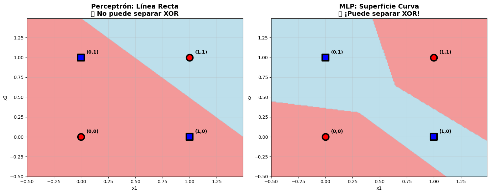

# Práctica 7: De Perceptrón a Redes Neuronales

En este ejercicio, se exploraron las bases de las redes neuronales, comenzando con el perceptrón simple para entender sus capacidades y limitaciones, y culminando en la implementación de redes neuronales multicapa (MLP) con herramientas profesionales como Scikit-learn, TensorFlow y PyTorch Lightning.

## Contexto
El objetivo fue doble. Primero, entender de manera interactiva por qué una sola neurona (perceptrón) no puede resolver problemas no lineales como el XOR. Segundo, aplicar una red neuronal multicapa (MLP) a un dataset sintético más complejo para demostrar cómo las arquitecturas profundas superan estas limitaciones y pueden resolver problemas de clasificación realistas.

## Objetivos
- Demostrar la capacidad de un perceptrón simple para resolver problemas linealmente separables (AND, OR, NOT).
- Visualizar y comprender por qué un perceptrón simple falla al intentar resolver el problema XOR.
- Implementar un `MLPClassifier` en Scikit-learn para resolver el problema XOR.
- Construir y comparar redes neuronales de clasificación binaria usando `Scikit-learn`, `TensorFlow` y `PyTorch Lightning`.
- Interpretar las curvas de aprendizaje y las matrices de confusión para evaluar el rendimiento de los modelos.

## Actividades (con tiempos estimados)

| Actividad | Tiempo | Resultado Esperado |
| :--- | :---: | :--- |
| **Análisis del Perceptrón** | 20 min | Comprensión visual de la separación lineal y el problema XOR. |
| **MLP con Scikit-learn** | 15 min | Modelo MLP funcional para datos sintéticos. |
| **Redes con TensorFlow/PyTorch**| 15 min | Modelos equivalentes en frameworks profesionales. |
| **Evaluación y Comparación** | 10 min | Análisis de curvas de aprendizaje y matrices de confusión. |

## Desarrollo
La práctica comenzó con una simulación de un perceptrón simple. Se ajustaron manualmente los pesos y el bias para resolver las compuertas lógicas AND, OR y NOT, demostrando que todas son linealmente separables. Luego, se intentó resolver la compuerta XOR, lo que falló consistentemente, evidenciando la necesidad de una arquitectura más compleja.

Para resolver XOR, se implementó un `MLPClassifier` de Scikit-learn con una arquitectura de dos capas ocultas `(4,4)`, que logró un 100% de precisión.

Finalmente, se aplicó este conocimiento a un dataset de clasificación binaria más complejo. Se construyeron, entrenaron y evaluaron tres modelos equivalentes: uno con `MLPClassifier`, otro con `TensorFlow/Keras` y un tercero con `PyTorch Lightning`. Todos los modelos lograron una precisión de prueba excelente (alrededor del 94%), demostrando la viabilidad de los tres frameworks.

## Evidencias
La evidencia visual más importante de esta práctica es la comparación de las superficies de decisión, que muestra por qué el MLP es superior al perceptrón para problemas no lineales.

???+ info "Evidencia 1: La Limitación del Perceptrón vs. el Poder del MLP"

    Estos gráficos comparan la capacidad de un perceptrón simple y un MLP para resolver el problema XOR.
    
    - **Izquierda (Perceptrón):** Muestra que una única línea recta es incapaz de separar correctamente las clases.
    - **Derecha (MLP):** Muestra cómo una red multicapa puede crear una superficie de decisión curva y no lineal, separando las clases a la perfección.

    { width="700" }

???+ info "Evidencia 2: Curvas de Aprendizaje (TensorFlow)"

    Las curvas de pérdida y precisión del entrenamiento del modelo de TensorFlow muestran una buena convergencia. Se observa un leve sobreajuste, ya que la precisión de entrenamiento alcanza el 100% mientras que la de validación se estabiliza en un valor inferior, y se abre una brecha entre las dos curvas de pérdida.

    *(Aquí puedes poner la captura de las curvas de Loss y Accuracy de TensorFlow)*
    `{ width="600" }`
    
???+ info "Evidencia 3: Comparación de Matrices de Confusión"

    Las matrices de confusión de los tres modelos (Sklearn, TensorFlow, PyTorch) en el dataset real fueron muy similares, todas demostrando un alto rendimiento con muy pocos errores de clasificación. Esto valida la robustez de los tres frameworks.
    
    *(Aquí puedes poner la captura de las 3 matrices de confusión comparativas)*
    `{ width="700" }`

## Reflexión
- **Qué aprendí:** Comprendí la diferencia fundamental entre un modelo lineal (perceptrón) y uno no lineal (MLP), y por qué las capas ocultas con funciones de activación son cruciales. Aprendí a implementar redes neuronales básicas en tres de los frameworks más importantes: Scikit-learn, TensorFlow y PyTorch Lightning, entendiendo sus diferentes niveles de abstracción y casos de uso.
- **Qué mejorarías:** Para el modelo de TensorFlow/PyTorch, se podrían implementar técnicas para combatir el leve sobreajuste observado, como el **Dropout** o el **Early Stopping**, para potencialmente mejorar aún más la precisión en el conjunto de prueba.
- **Próximos Pasos:** El siguiente paso sería aplicar estos conocimientos a datasets más grandes y complejos. Además, se podrían explorar arquitecturas de red más profundas, diferentes optimizadores y funciones de pérdida para resolver problemas más desafiantes.

## Referencias
- **Documentación:** [Scikit-learn MLPClassifier](https://scikit-learn.org/stable/modules/generated/sklearn.neural_network.MLPClassifier.html), [TensorFlow Docs](https://www.tensorflow.org/api_docs), [PyTorch Lightning Docs](https://lightning.ai/docs/pytorch/stable/)
- **Notebook de Análisis:** [https://colab.research.google.com/drive/1aiS8cjuDedrE0xmoenzyTBpTXGkD9YuV?usp=sharing](https://colab.research.google.com/drive/1aiS8cjuDedrE0xmoenzyTBpTXGkD9YuV?usp=sharing)
