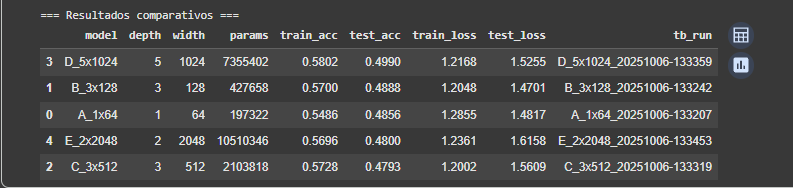
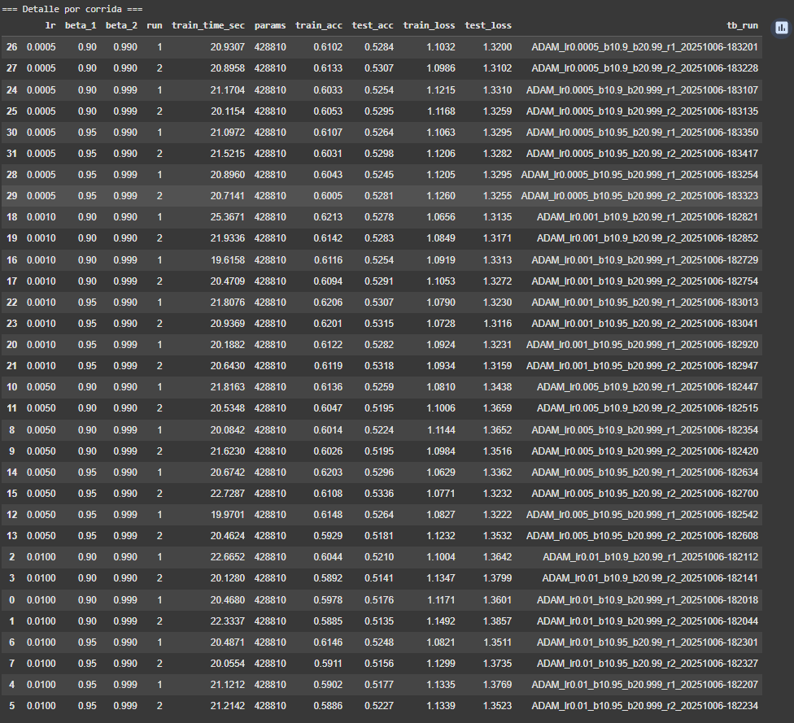

# Cómo enseñar a una red a aprender mejor: backpropagation y optimización en CIFAR-10

La práctica aborda el entrenamiento de un **perceptrón multicapa (MLP)** sobre **CIFAR-10** para estudiar el efecto de la **arquitectura**, la **regularización**, los **optimizadores** y los **callbacks** en el rendimiento. Se privilegió un flujo experimental reproducible, con registros en TensorBoard y evidencias en formato gráfico/tabular.

---

## Contexto
El objetivo general fue **analizar backpropagation en un MLP simple** y cuantificar cómo las decisiones de diseño (capas, activaciones, normalización, regularización) y de entrenamiento (optimizadores, tasas de aprendizaje y callbacks) impactan en **convergencia, estabilidad y exactitud** en un problema clásico de visión.

## Objetivos
- Establecer un **baseline** de MLP en CIFAR-10 y comparar variantes de **profundidad/ancho**.
- Evaluar **activaciones**, **Batch Normalization**, **Dropout** y **L2**.
- Comparar **Adam, SGD, RMSprop y AdamW** con barridos de hiperparámetros.
- Medir el aporte de **callbacks** (EarlyStopping, ReduceLROnPlateau, ModelCheckpoint) y **schedulers** (warmup, cosine, step).
- Consolidar **conclusiones prácticas** y una **receta reproducible**.

## Actividades (con tiempos estimados)

| Actividad                              | Tiempo | Resultado esperado                                               |
|----------------------------------------|:------:|------------------------------------------------------------------|
| Baseline MLP y verificación de datos   |  20m   | Entrenamiento base y curvas de referencia                        |
| Arquitectura y activaciones            |  45m   | Comparativa de ancho/profundidad y funciones de activación       |
| Regularización (BN, Dropout, L2)       |  45m   | Configuración estable y con menor sobreajuste                    |
| Optimizadores e hiperparámetros        |  60m   | Barridos de LR/momentum/betas y elección informada               |
| Callbacks y scheduling de LR           |  60m   | Entrenamiento más corto y/o mejor exactitud                      |
| Organización de evidencias e informe   |  30m   | Entrada del portafolio con figuras y conclusiones                |

---

## Desarrollo

### 1) Baseline y arquitectura
- Se partió de un MLP con imágenes **aplanadas (32×32×3 → 3072)**, normalizadas a **[-1, 1]**.
- Comparaciones de **1–5 capas** y **64–2048** neuronas mostraron que **3×128** es un *sweet spot*: buena capacidad con tiempos razonables.

**Conclusiones**  
- Aumentar profundidad/ancho de forma agresiva **no** garantizó mejoras en test; sí elevó parámetros y tiempo.
- **ReLU** y **GELU** ofrecieron comportamientos similares; **tanh** quedó por detrás.

### 2) Regularización
- **Batch Normalization** antes de la activación estabilizó y aceleró el entrenamiento.  
- **Dropout** moderado (**≈0.10**) funcionó mejor que tasas altas; es más efectivo **después** de densas intermedias que en la entrada.
- La penalización **L2** leve (≈**5e-5–1e-4**) ayudó a contener el sobreajuste sin degradar la convergencia.

**Conclusiones**  
- La combinación **BN + Dropout(0.10) + L2** produjo las curvas más limpias y repetibles.

### 3) Optimizadores e hiperparámetros
- **Adam**: barridos de `lr ∈ {1e-2, 5e-3, 1e-3, 5e-4}` y `β1/β2` estándar; exactitudes ~**0.52–0.53** con LR fijos.  
- **SGD** (con/ sin Nesterov): sensible a LR y momentum; resultados en el rango **0.50–0.52**.  
- **RMSprop** (`lr≈1e-3`, `rho≈0.90–0.95`): desempeño **sólido y estable** con LR fijos (~**0.53**).  
- **AdamW** con *weight decay* desacoplado (1e-5–1e-4): comportamiento muy cercano a Adam.

**Conclusión clave**  
- Con **LR fijos**, **RMSprop** y **Adam** fueron competitivos.  
- Con **programación de LR** (warmup + cosine o **ReduceLROnPlateau**), **Adam** **mejoró** y alcanzó el **mejor test** (~**0.555–0.561**), superando sus propios resultados con LR constante.

### 4) Callbacks y schedulers
- **EarlyStopping** (monitor `val_accuracy`, paciencia 5, `restore_best_weights=True`) redujo tiempo sin pérdida de métrica.  
- **ModelCheckpoint** (mejor por `val_accuracy`) confirmó que la **última época no siempre** es la mejor.  
- **ReduceLROnPlateau** (monitor `val_loss`, factor 0.5, paciencia 2–3) fue especialmente efectivo para salir de mesetas.  
- **LearningRateScheduler**:
  - **Warmup corto + cosine**: test ≈ **0.555–0.556**.
  - **Step decay**: correcto pero inferior a cosine y RLROP.

**Receta resultante**  
MLP **3×128** + **BN** + **Dropout(0.10)** + **L2 (≈5e-5)**, **Adam** con **LR scheduling** (warmup+cosine *o* RLROP), `batch_size=128`, y callbacks **EarlyStopping** + **ModelCheckpoint**.

---

## Evidencias

???+ info "Contexto y baseline"
    - Muestra del dataset y salida inicial.
    - Curvas base de *accuracy* y *loss*.

    [{ width="380" }](../assets/fig3_cifar10.png)
    [{ width="380" }](../assets/fig04_tf_output.png)
    [{ width="380" }](../assets/ig5_acc.png)
    [{ width="380" }](../assets/fig6_loss.png)

???+ info "Arquitectura y activaciones"
    - Comparación de profundidad/ancho.
    - Activaciones: ReLU, GELU, tanh y sus curvas.

    [{ width="420" }](../assets/fig7_tabla_experimentos.png)

    [{ width="420" }](../assets/fig11_tabla_activaciones_avg.png)
    [{ width="420" }](../assets/fig8_tabla_activaciones.png)
    [{ width="420" }](../assets/fig9_acc_activaciones.png)
    [{ width="420" }](../assets/fig10_loss_activaciones.png)

???+ info "Batch Normalization (BN)"
    - Tabla resumen ON vs OFF y curvas de *accuracy/loss*.

    [{ width="420" }](../assets/fig14_tabla_bn.png)
    [{ width="420" }](../assets/fig16_acc_bn_on.png)
    [{ width="420" }](../assets/fig15_acc_bn_off.png)
    [{ width="420" }](../assets/fig18_loss_bn_on.png)
    [{ width="420" }](../assets/fig17_loss_bn_off.png)

???+ info "Regularización: Dropout y L2"
    - Dropout por posición/tasa y detalle de corridas.
    - Barrido de **L2**.

    [{ width="420" }](../assets/fig19_do_avg.png)
    [{ width="420" }](../assets/fig20_do_runs.png)
    [{ width="420" }](../assets/fig23_l2.png)

???+ info "Inicialización y tamaño de batch"
    - He Normal vs Glorot.
    - Batch size 32–256.

    [{ width="420" }](../assets/fig24_init.png)
    [{ width="420" }](../assets/fig25_batch.png)

???+ info "Optimizadores: Adam, SGD, RMSprop, AdamW"
    - **Adam**, promedios y detalle:
    
    [{ width="420" }](../assets/fig27_adam_avg.png)
    [{ width="420" }](../assets/fig28_adam_runs.png)

    - **SGD**, promedios y detalle:

    [{ width="420" }](../assets/fig29_sgd_avg.png)
    [{ width="420" }](../assets/fig30_sgd_runs.png)

    - **RMSprop**, promedios y detalle:

    [{ width="420" }](../assets/fig31_rmsprop_avg.png)
    [{ width="420" }](../assets/fig32_rmsprop_runs.png)

    - **AdamW**, promedios y detalle:

    [{ width="420" }](../assets/fig33_adamw_avg.png)
    [{ width="420" }](../assets/fig34_adamw_runs.png)

???+ info "Métricas de compilación"
    - Accuracy clásica y *top-k*.

    [{ width="420" }](../assets/fig35_compile_avg.png)
    [{ width="420" }](../assets/fig36_compile_runs.png)

???+ info "Callbacks"
    - **EarlyStopping** (promedio y detalle).

    [{ width="420" }](../assets/fig37_es_avg.png)
    [{ width="420" }](../assets/fig38_es_runs.png)

    - **ReduceLROnPlateau** y **ModelCheckpoint**.

    [{ width="420" }](../assets/fig39_rlrop.png)
    [{ width="420" }](../assets/fig40_ckpt.png)

???+ info "Schedulers de LR"
    - Warmup + cosine, cosine puro y step decay.

    [{ width="700" }](../assets/fig46_lrsched.png)

---

## Reflexión

- En MLPs para visión con datos crudos, **la ingeniería de entrenamiento** (BN, Dropout, L2, callbacks y programación del LR) aporta más que incrementar ciegamente la capacidad del modelo.  
- Con LR fijos, **RMSprop** y **Adam** presentan rendimientos similares; **al introducir schedulers**, **Adam** sobresale.  
- **ReduceLROnPlateau** y **EarlyStopping** mejoran la eficiencia: menos épocas efectivas y mejor aprovechamiento del presupuesto de tiempo.  
- Un **próximo paso natural** es repetir la receta en una **CNN compacta** (con *data augmentation*), donde se espera superar con claridad el techo del MLP en CIFAR-10.

## Referencias
- **Documentación oficial de TensorFlow:** capas densas, activaciones, `BatchNormalization`, `Dropout`, `regularizers.l2`, inicializadores, optimizadores (`Adam`, `SGD`, `RMSprop`, `AdamW`) y callbacks (`EarlyStopping`, `ReduceLROnPlateau`, `ModelCheckpoint`, `LearningRateScheduler`).  
- **Guías de TensorBoard:** comparación de *runs*, escalas e histogramas.
- **Notebook de Análisis:** [https://colab.research.google.com/drive/1y0_rvGbG8oD9hEtveTUiNiQmiG7Ow6VV?usp=sharing](https://colab.research.google.com/drive/1y0_rvGbG8oD9hEtveTUiNiQmiG7Ow6VV?usp=sharing)
