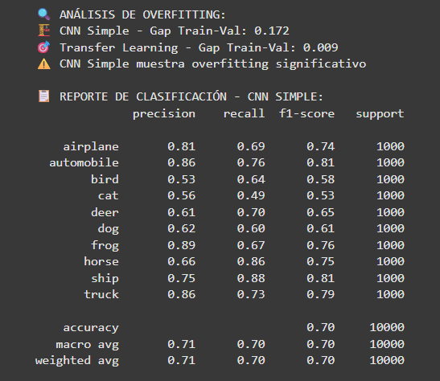

# Práctica 9: CNNs y Transfer Learning con TensorFlow/Keras

La práctica aborda la construcción de **CNNs desde cero** y la aplicación de **Transfer Learning** con modelos de `keras.applications`. Se trabaja sobre **CIFAR-10** y, en una segunda parte, se replica el flujo sobre datasets de dominio (PlantVillage y Cats vs Dogs). Se compara el rendimiento, se analizan curvas de entrenamiento/validación y se prueban variantes de arquitectura, fine-tuning y optimizadores.

## Contexto

- **Problema:** Clasificación automática de imágenes.
- **Dataset base:** **CIFAR-10** (10 clases).
- **Objetivo:** Entrenar una CNN simple y un modelo con Transfer Learning; comparar métricas y comportamiento (overfitting, velocidad, capacidad).

## Objetivos

- Implementar una **CNN 2D** mínima para imágenes RGB 32×32.
- Aplicar **Transfer Learning** con `MobileNetV2` (y luego **EfficientNetB0**).
- Incorporar **callbacks** (EarlyStopping) y evaluar **accuracy/loss**.
- Explorar **fine-tuning** y **regularización** (BN + Dropout).
- Probar **optimizadores/learning rates**.
- Replicar el pipeline en **datasets de dominio**.

## Actividades (con tiempos estimados)

| Actividad | Tiempo | Resultado Esperado |
| :--- | :---: | :--- |
| **CNN desde cero (CIFAR-10)** | 15–20 min | Baseline de precisión y arquitectura funcional. |
| **Transfer Learning (MobileNetV2)** | 15 min | Pipeline con base congelada y GAP. |
| **Evaluación y análisis** | 10 min | Curvas, reportes y *gap* de overfitting. |
| **Investigación guiada (A–E)** | 25–35 min | BN/DO, FT, cambio de base (EfficientNet), optimizadores. |
| **Datasets de dominio** | 20–30 min | Resultados en PlantVillage y Cats vs Dogs. |

## Desarrollo

### 1) Setup y verificación del entorno

Se configuró TensorFlow con soporte de GPU (cuando estaba disponible) y seeds para reproducibilidad.

???+ info "Evidencia: Setup de entorno"
    { width="560" }

### 2) Carga y preprocesamiento (CIFAR-10)

- Carga con `keras.datasets.cifar10`.
- Normalización a `[0,1]`.
- One-hot encoding de etiquetas.

???+ info "Evidencia: Información del dataset"
    { width="700" }

### 3) CNN simple (desde cero)

- Dos bloques `Conv2D → ReLU → MaxPooling2D`.
- `Flatten → Dense(512) → Dense(10, softmax)`.
- Optimizador **Adam** (`lr=1e-3`), pérdida `categorical_crossentropy`.

???+ info "Evidencia: Arquitectura CNN simple"
    { width="740" }

### 4) Transfer Learning (MobileNetV2)

- `MobileNetV2(weights='imagenet', include_top=False)`.
- Congelado completo + `Flatten → Dense(10)`.
- Compilación con **Adam** `lr=1e-3`.
- (Más adelante) **fine-tuning** de las últimas capas con `lr=1e-4`.

???+ info "Evidencia: Arquitectura TL con MobileNetV2"
    { width="700" }

### 5) Entrenamiento con EarlyStopping

Se entrenaron **10 épocas** con `EarlyStopping(monitor='val_accuracy', patience=3, restore_best_weights=True)` para ambos modelos.

???+ info "Evidencia: Log de entrenamiento (CNN simple)"
    { width="900" }

???+ info "Evidencia: Log de entrenamiento (Transfer Learning)"
    { width="900" }

### 6) Evaluación y comparación

- Se calcularon métricas en test y se generaron gráficos de precisión/pérdida y análisis de **overfitting** (gap train-val).
- Se imprimieron **classification reports** por clase.

???+ info "Evidencia: Comparación global y curvas"
    { width="1100" }

???+ info "Evidencia: Reporte de clasificación — CNN Simple"
    { width="700" }

???+ info "Evidencia: Reporte de clasificación — Transfer Learning"
    { width="700" }

---

## Investigación Libre

Se ejecutaron experimentos adicionales manteniendo el código base y completando únicamente lo requerido.

### Experimento A — **CNN con BN + Dropout**

- Arquitectura: se añadieron **BatchNormalization** y **Dropout** y se sustituyó `Flatten` por **GlobalAveragePooling2D**.
- Objetivo: mejorar generalización y estabilidad.

???+ info "A1) Summary CNN BN+DO"
    { width="760" }

???+ info "A2) Entrenamiento (re-run controlado)"
    { width="900" }

### Experimento B — **Transfer Learning con MobileNetV2 (224→128)**

- TL congelado con GAP y capa densa final.
- Entrenamiento en 128×128 para costo razonable.

???+ info "B) Summary + Log"
    { width="1100" }

### Experimento C — **Fine-tuning (MobileNetV2, últimas 20 capas)**

- Descongelado selectivo (tail) + **Adam(1e-4)**.
- Mejora de *feature alignment* sobre CIFAR-10.

???+ info "C) Log fine-tuning (20 capas)"
    { width="900" }

### Experimento D — **EfficientNetB0 (frozen) + fine-tuning (últimas 30)**

- Se probó `EfficientNetB0` congelado y luego FT de 30 capas con **Adam(1e-4)**.

???+ info "D1) Summary EfficientNetB0 (frozen)"
    { width="820" }

???+ info "D2) Entrenamiento frozen → FT (30 capas)"
    { width="1000" }

### Experimento E — **Búsqueda rápida de LR/Optimizador (CNN BN+DO)**

- Configuraciones: `Adam(1e-3)`, `Adam(5e-4)`, `SGD(m=0.9, nesterov)`, `RMSprop(1e-3)`.
- Métrica: mejor `val_accuracy`.

???+ info "E) Resultados búsqueda LR/Opt"
    { width="560" }

---

## Next Steps: Datasets de Dominio

### PlantVillage (multi-clase, submuestreo controlado)

- Descarga con `kagglehub` y submuestreo por clase para ajustar a RAM.
- Modelo: **MobileNetV2** (congelado) + GAP + Dense.
- Entrenamiento corto (5 épocas) para *sanity check*.

???+ info "Evidencia: Log PlantVillage (submuestreo)"
    { width="1100" }

### Cats vs Dogs (binario, TFDS)

- Carga con **TFDS**, re-escala a 160×160, balanceo simple y AUC.
- Modelo: **MobileNetV2** (congelado) + GAP + Dense(1, sigmoid).
- Resultado validación: **val_acc ≈ 0.98**, **val_auc ≈ 0.998**.

???+ info "Evidencia: Entrenamiento Cats vs Dogs (TFDS)"
    { width="1100" }

---

## Resultados destacados

- En **CIFAR-10**, la **CNN simple** alcanzó ~**70%** de *test accuracy* con claro **gap** train-val (overfitting moderado).
- El **Transfer Learning** con MobileNetV2 **congelado** fue inferior en CIFAR-10 (data pequeña y 32×32), pero **mejoró** sensiblemente tras **fine-tuning**.
- **EfficientNetB0** con FT de 30 capas mostró el **mejor perfil de validación** en el set base.
- En datasets de dominio:
  - **PlantVillage** (versión submuestreada) sirvió como validación rápida del pipeline.
  - **Cats vs Dogs (TFDS)** alcanzó métricas **muy altas** (val_acc ≈ **98%**).

## Reflexión

- **Transfer Learning** ofrece *features* reutilizables, pero **no siempre gana congelado** en imágenes muy pequeñas (32×32) y dominio distante; el **fine-tuning** marca la diferencia.
- **BN + Dropout** reducen el overfitting en la CNN pequeña.
- La elección de **optimizador y LR** impacta de forma notable; **Adam(5e-4)** fue un buen compromiso en las pruebas rápidas.
- Para problemas reales, conviene:
  1) iniciar con **TL congelado** para verificar señal,
  2) **descongelar por bloques** con **LR bajo**,
  3) usar **augmentación** y **EarlyStopping/ReduceLROnPlateau**.

## Referencias

- TensorFlow / Keras Applications — Documentación oficial.  
- Papers y *model cards* de **MobileNetV2** y **EfficientNet**.  
- CIFAR-10 dataset y TFDS.  
- Kaggle PlantVillage dataset (vía `kagglehub`).
- **Notebook (Colab):** [https://colab.research.google.com/drive/1Hb9-lq-hMfjrYV9kqHNnL7mL0Kk3FouS?usp=sharing](https://colab.research.google.com/drive/1Hb9-lq-hMfjrYV9kqHNnL7mL0Kk3FouS?usp=sharing)

