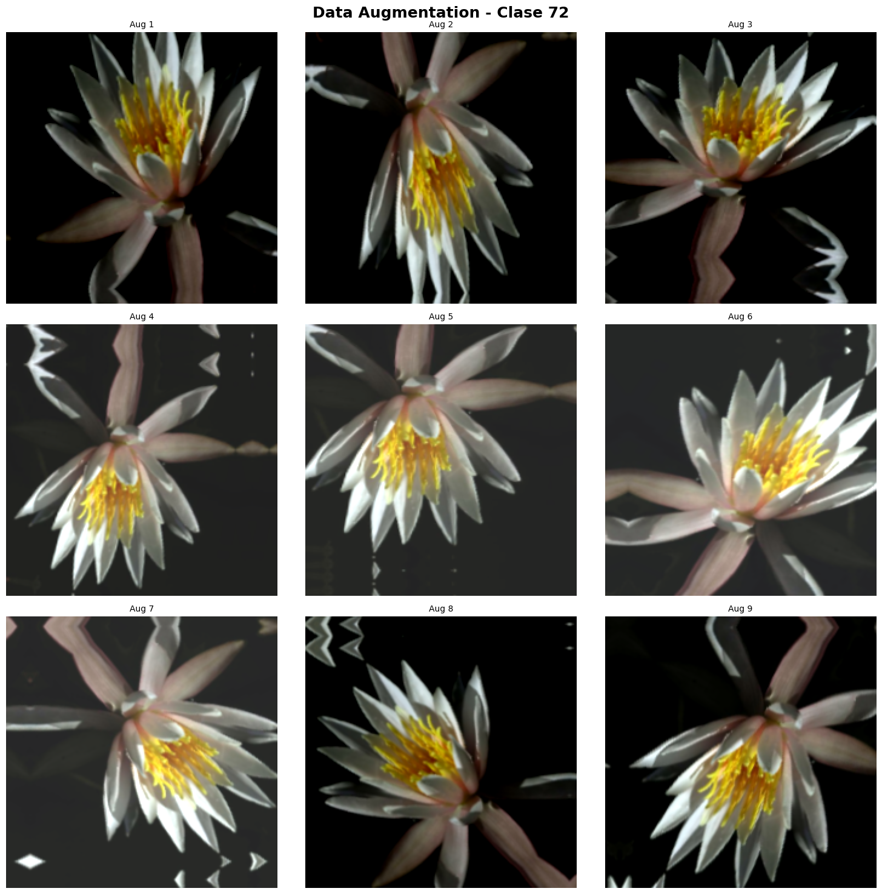
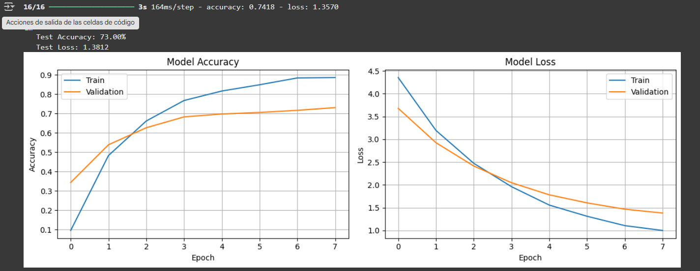
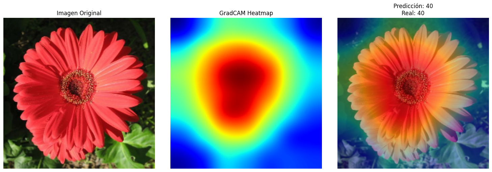
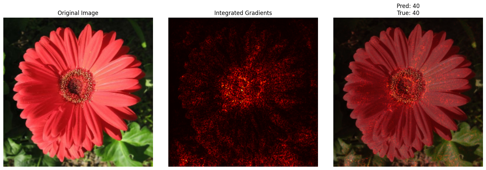

# Cómo enseñar a una red a mirar con atención: Data Augmentation y Explicabilidad

Esta práctica tuvo como objetivo aplicar técnicas avanzadas de aumento de datos (Data Augmentation) y explicabilidad visual (GradCAM e Integrated Gradients) utilizando el dataset *Oxford Flowers102* con modelos preentrenados de *Keras Applications*.

## Contexto
En esta práctica se trabajó con un dataset de imágenes de flores de 102 clases, aplicando *transfer learning* con **EfficientNetB0** para desarrollar un modelo robusto capaz de generalizar ante variaciones de iluminación, ángulo y fondo.  
Además, se aplicaron técnicas de explicabilidad visual para analizar qué regiones de las imágenes utiliza el modelo al tomar decisiones.

## Objetivos
- Implementar un pipeline de **data augmentation avanzado** con capas de Keras.  
- Entrenar un modelo preentrenado (EfficientNetB0) sobre el dataset *Oxford Flowers102*.  
- Evaluar su rendimiento y robustez frente a perturbaciones visuales.  
- Aplicar **GradCAM** e **Integrated Gradients** para interpretar las predicciones del modelo.  
- Analizar visualmente qué partes de las imágenes son relevantes para la clasificación.

## Actividades (con tiempos estimados)

| Actividad | Tiempo | Resultado Esperado |
| :--- | :---: | :--- |
| **Preparación del dataset y pipelines** | 25 min | Dataset de entrenamiento y prueba con resize y preprocesamiento listo. |
| **Implementación de Data Augmentation** | 20 min | Pipeline avanzado con flips, rotaciones, brillo y contraste. |
| **Entrenamiento del modelo EfficientNetB0** | 40 min | Modelo entrenado con accuracy estable. |
| **Evaluación de resultados** | 15 min | Curvas de precisión y pérdida; análisis de métricas. |
| **Aplicación de GradCAM e Integrated Gradients** | 30 min | Explicaciones visuales claras sobre predicciones correctas. |

## Desarrollo
El flujo comenzó con la descarga y preparación del dataset *Oxford Flowers102*, limitando el subconjunto a 5000 imágenes de entrenamiento y 1000 de prueba para una ejecución más rápida.  
Se implementaron dos pipelines: uno **baseline** sin aumentos y otro **avanzado** con capas de `RandomFlip`, `RandomRotation`, `RandomZoom`, `RandomTranslation`, `RandomBrightness` y `RandomContrast`.  

Se entrenó un modelo **EfficientNetB0** con pesos preentrenados de ImageNet, congelando la base y agregando una capa `GlobalAveragePooling2D` seguida de una capa densa `softmax`. El modelo alcanzó una precisión de validación del **73 %**, mostrando una curva de aprendizaje estable y sin sobreajuste.  

Posteriormente, se aplicaron **GradCAM** e **Integrated Gradients** para interpretar las decisiones del modelo.  
GradCAM permitió visualizar las regiones de activación dentro de la flor (principalmente en los pétalos), mientras que Integrated Gradients confirmó la contribución positiva de esos mismos píxeles. Ambos métodos demostraron que el modelo basaba sus decisiones en características relevantes y no en el fondo.

## Evidencias

???+ info "Evidencia 1: Data Augmentation"
    
    Muestra distintas transformaciones aplicadas a una misma imagen del dataset (flips, rotaciones, zooms, cambios de brillo y contraste).  
    Esto refuerza la capacidad del modelo para generalizar frente a variaciones visuales.
    
    { width="650" }

???+ info "Evidencia 2: Curvas de Entrenamiento y Validación"
    
    Las curvas de accuracy y loss muestran una mejora continua sin sobreajuste, con una accuracy final de validación de alrededor del 73%.  
    La pérdida de validación disminuye de forma estable, reflejando buena convergencia.
    
    { width="650" }

???+ info "Evidencia 3: GradCAM — Atención del Modelo"
    
    La visualización de GradCAM muestra que el modelo concentra su atención en las zonas centrales de los pétalos, lo cual valida que la red está aprendiendo patrones visuales relevantes y no ruido del fondo.
    
    { width="650" }

???+ info "Evidencia 4: Integrated Gradients — Atribución de Píxeles"
    
    Integrated Gradients revela los píxeles que más influyen en la predicción. Se observa una correspondencia con GradCAM, confirmando que el modelo fundamenta correctamente sus decisiones.
    
    { width="650" }

## Reflexión

- **1. Data Augmentation:**  
  El *data augmentation* mejoró significativamente la precisión del modelo y redujo el riesgo de sobreajuste. Al introducir variaciones en orientación, brillo y escala, el modelo aprendió a ser más robusto y generalizar mejor ante imágenes con diferentes condiciones.

- **2. GradCAM:**  
  En la mayoría de los ejemplos, el modelo enfocó su atención en las regiones correctas — los pétalos o el centro de la flor — lo que demuestra que comprendió las características más importantes. Las visualizaciones fueron coherentes y consistentes con la predicción correcta.

- **3. Errores del Modelo:**  
  En algunos errores, el modelo centró su atención en áreas parciales o en bordes de la flor, lo que explica confusiones entre especies de color y forma similares. Esto muestra que los errores no son aleatorios, sino que tienen una base visual.

- **4. Aplicación Práctica:**  
  En una aplicación de identificación de flores, la explicabilidad es clave para generar confianza. Poder mostrar al usuario *por qué* una flor fue clasificada de cierta forma aumenta la transparencia y evita depender ciegamente del modelo.

- **5. Mejoras:**  
  Con más tiempo, se podría aplicar *fine-tuning* de las últimas capas de EfficientNetB0, usar **Mixup/CutMix**, probar arquitecturas más grandes como **EfficientNetB3**, o balancear las clases del dataset. Estas mejoras podrían elevar la precisión por encima del 80 %.

## Referencias
- **Papers y documentación:**  
  - [GradCAM: Visual Explanations from Deep Networks via Gradient-based Localization](https://arxiv.org/abs/1610.02391)  
  - [Integrated Gradients Paper](https://arxiv.org/abs/1703.01365) 
  - [TensorFlow Datasets - Oxford Flowers102](https://www.tensorflow.org/datasets/catalog/oxford_flowers102)
  - **Notebook de Análisis:** [https://colab.research.google.com/drive/1dQYoiAtPtsJ6IeX6BIPB-HFy6TMtX4vG?usp=sharing](https://colab.research.google.com/drive/1dQYoiAtPtsJ6IeX6BIPB-HFy6TMtX4vG?usp=sharing)
