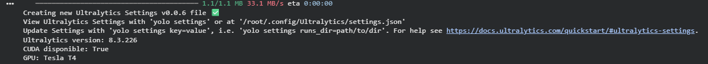
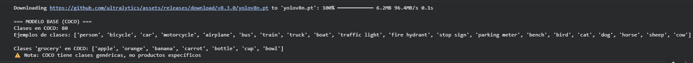
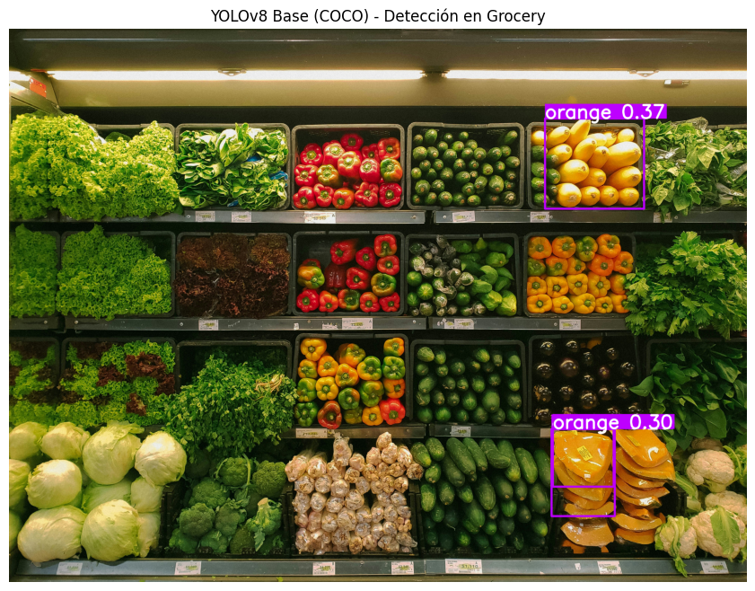
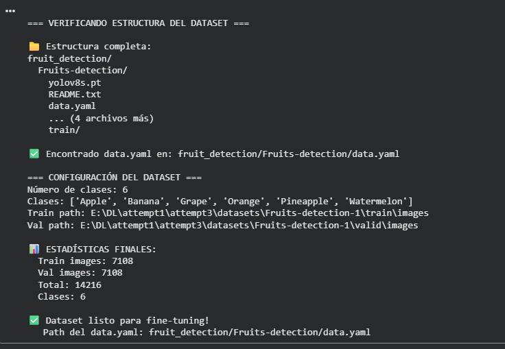
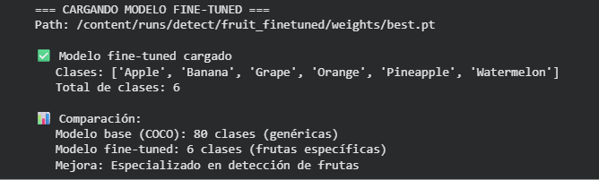
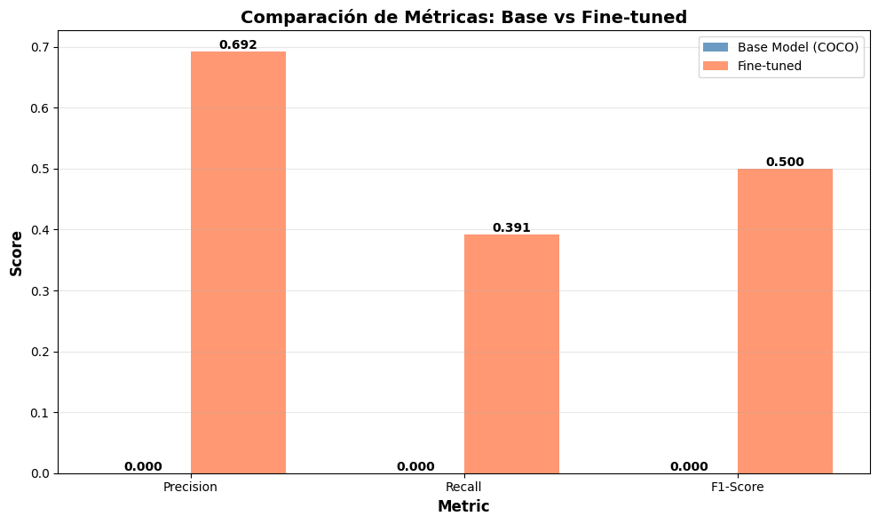
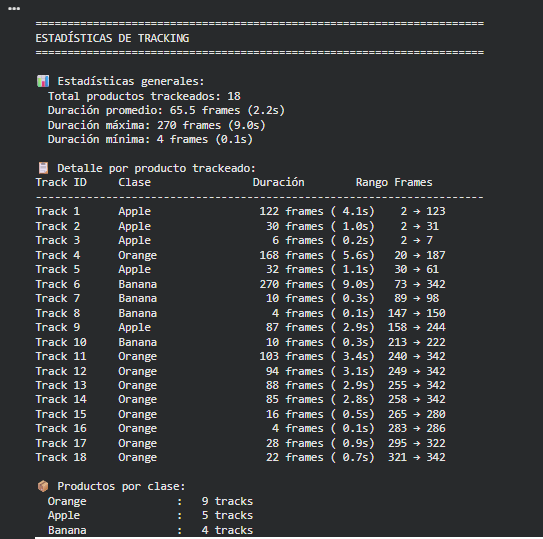
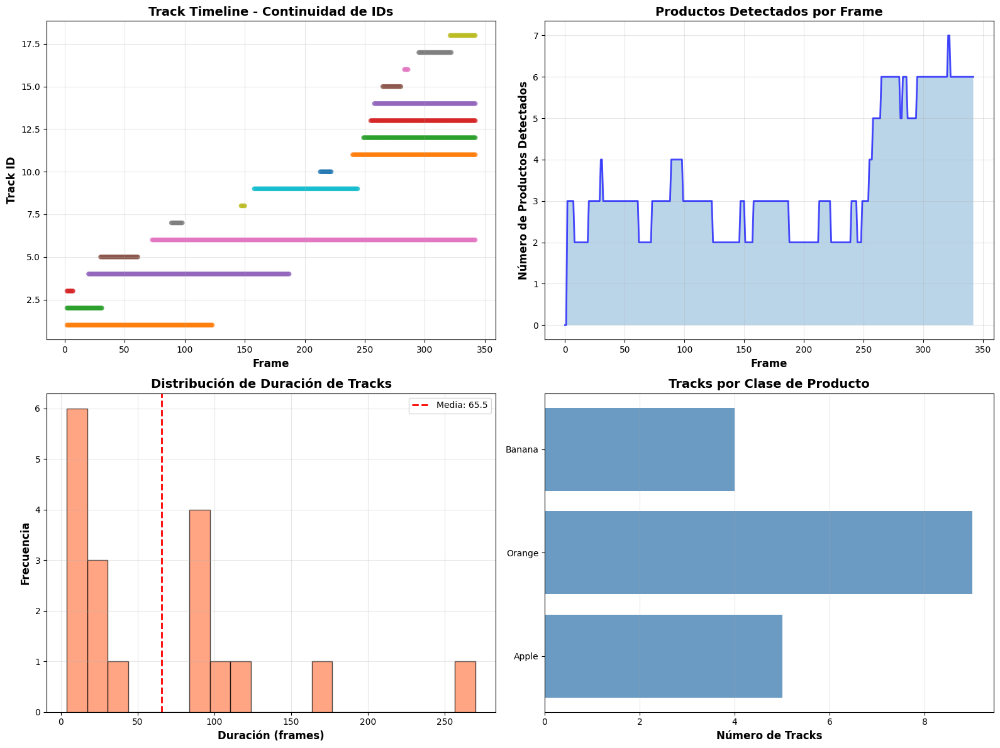

# De detector genérico a sistema de inventario inteligente: Fine-tuning y tracking con YOLOv8

## Contexto
En esta práctica exploré cómo adaptar un modelo de visión por computadora a un dominio específico. Aunque YOLOv8 pre-entrenado en COCO puede detectar frutas de forma genérica, su desempeño real en un supermercado es limitado: no distingue variedades, tamaños, ni contextos donde las frutas están agrupadas o se superponen.  
El objetivo fue entrenar el modelo con un dataset específico de frutas y luego aplicar **tracking** en video para simular un sistema de conteo y monitoreo en tiempo real.

## Objetivos
- Realizar inferencia base con YOLOv8 pre-entrenado y analizar sus limitaciones.
- Fine-tunear YOLOv8 en un dataset específico de frutas para mejorar detección.
- Evaluar métricas antes y después del entrenamiento (recall, precision, mAP).
- Implementar tracking en video usando Norfair para mantener IDs consistentes.
- Reflexionar sobre la aplicación real del sistema en escenarios de retail.

## Actividades (con tiempos estimados)

| Actividad | Tiempo | Resultado Esperado |
|---|:---:|---|
| Exploración del modelo base | 20 min | Comprender limitaciones del modelo COCO |
| Descarga y análisis del dataset | 25 min | Confirmar estructura y distribución de clases |
| Entrenamiento (fine-tuning) | 40 min | Modelo especializado en frutas |
| Evaluación & comparación | 30 min | Métricas y análisis de errores |
| Tracking en video | 35 min | Seguimiento estable de frutas en movimiento |

## Desarrollo

El flujo de la práctica siguió tres etapas principales:

1. **Inferencia Base:** Se probó YOLOv8n pre-entrenado en una imagen de góndola. El modelo detectó muy pocos objetos útiles, lo que confirmó que las clases genéricas de COCO no son suficientes para casos de retail.

2. **Fine-Tuning:** Se descargó el dataset *Fruit Detection* (formato YOLO) y se entrenó el modelo durante 10 epochs. Las pérdidas decrecieron de forma estable y el modelo comenzó a reconocer frutas individuales con mayor precisión.

3. **Tracking:** Con el modelo entrenado, se aplicó tracking con Norfair en un video de frutas en movimiento. Se observaron IDs consistentes a lo largo de los frames, permitiendo seguimiento fluido y conteo confiable.

## Evidencias

???+ info "Visualización del entorno y configuración inicial"
    { width="500" }
    El entorno contaba con GPU disponible, permitiendo entrenamiento eficiente.

???+ info "Modelo Base YOLOv8n (pre-entrenado en COCO)"
    { width="500" }
    Las clases eran genéricas y no útiles para inventario real.

???+ info "Inferencia inicial sin fine-tuning"
    { width="500" }
    El modelo no detectó correctamente productos reales en góndola.

???+ info "Verificación de la estructura del dataset"
    { width="500" }
    El dataset estaba en formato YOLO estándar, sin necesidad de limpieza.

???+ info "Distribución de clases"
    { width="600" }
    Las clases más frecuentes luego fueron las mejor detectadas.

???+ info "Resultados del entrenamiento"
    { width="600" }
    Las pérdidas disminuyeron de forma estable, sin sobreajuste fuerte.

???+ info "Evaluación del modelo fine-tuned"
    { width="450" }
    El modelo quedó especializado en 6 clases de frutas específicas.

???+ info "Comparación Base vs Fine-tuned"
    { width="650" }
    El modelo fine-tuned detectó más frutas con bounding boxes más precisas.

???+ info "Comparación de métricas"
    { width="600" }
    El F1-score aumentó y los falsos negativos disminuyeron notablemente.

???+ info "Estadísticas del tracking"
    { width="650" }
    IDs consistentes y seguimiento prolongado en la mayoría de objetos.

???+ info "Gráficos de tracking"
    { width="750" }
    Buena continuidad entre detecciones a lo largo del video.

???+ info "Captura del video final"
    { width="650" }
    El sistema de tracking funciona de forma estable y legible visualmente.

## Reflexión

Este proyecto mostró la diferencia entre **detectar** y **usar detecciones en un sistema real**.  
El modelo base era un buen punto de partida, pero no resolvía el problema. Recién al entrenarlo con datos específicos el modelo fue capaz de reconocer frutas reales con precisión.

La parte de tracking fue clave para darle utilidad práctica al modelo: ya no se trataba solo de “dibujar cajas”, sino de **seguir objetos en movimiento**, mantener su identidad y poder contarlos.  
Se sintió como un paso real hacia aplicaciones de retail como autocobro, auditoría de inventario o reposición automática.

Si continúo este proyecto, mejoraría el dataset con más casos difíciles (frutas en bolsas, pilas densas, iluminación cambiante) y probaría trackers más avanzados como DeepSORT para reducir los switches.

## Referencias

- Ultralytics YOLOv8 Docs: https://docs.ultralytics.com
- Norfair Tracker: https://github.com/tryolabs/norfair
- Dataset utilizado: https://www.kaggle.com/datasets/lakshaytyagi01/fruit-detection
- Notebook original de la práctica: [https://colab.research.google.com/drive/1TiFzMD3Qzlojs9-L8e4OQwwrnGU4Zgv9?usp=sharing](https://colab.research.google.com/drive/1TiFzMD3Qzlojs9-L8e4OQwwrnGU4Zgv9?usp=sharing)
