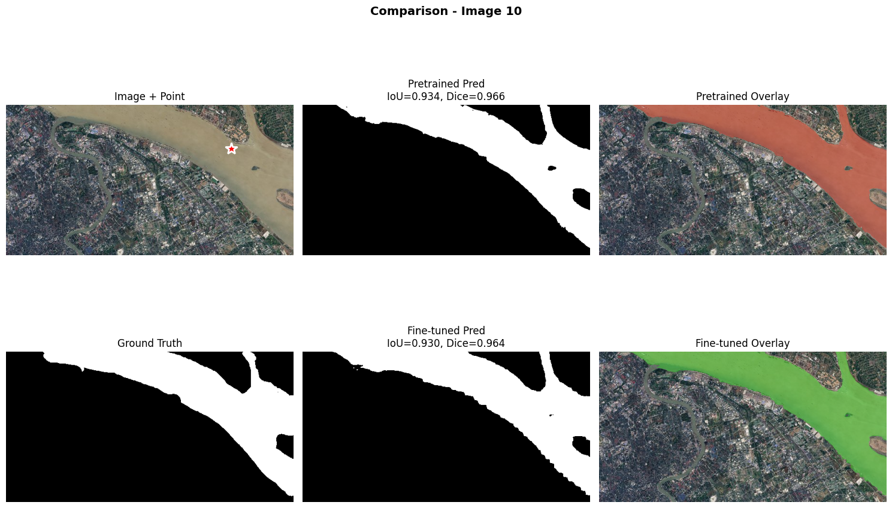
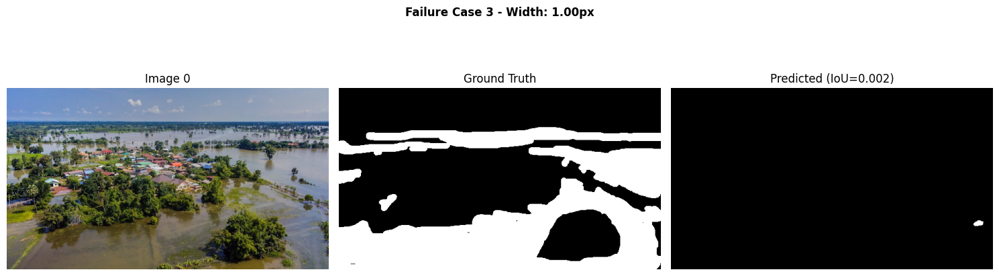

# Práctica 12: Fine-tuning de SAM para Segmentación de Inundaciones

En esta práctica se realizó el fine-tuning del modelo Segment Anything (SAM) para el caso de uso de detección de agua en imágenes de inundaciones. A partir de un modelo preentrenado generalista, se entrenó un modelo especializado capaz de segmentar con mayor precisión cuerpos de agua en condiciones reales de desastre.

---

## Contexto
El objetivo de esta práctica fue adaptar un modelo de segmentación de propósito general (SAM) a un dominio específico: imágenes de inundaciones capturadas desde drones o satélites. Esto permite evaluar cómo un modelo de visión por computadora puede ser ajustado para un entorno realista y desafiante, en el que la detección de agua tiene implicaciones prácticas para la gestión de emergencias.

## Objetivos
- Comprender y aplicar el proceso de fine-tuning sobre el modelo SAM.  
- Evaluar y comparar el rendimiento preentrenado vs. ajustado en un conjunto de validación.  
- Analizar los casos de éxito y fallos del modelo en detección de agua.  
- Reflexionar sobre los desafíos y potenciales del uso de IA en respuesta a desastres naturales.

---

## Actividades (con tiempos estimados)

| Actividad | Tiempo | Resultado Esperado |
|------------|:------:|--------------------|
| Preparación y carga de datos | 30 min | Dataset listo para entrenamiento (imágenes + máscaras). |
| Configuración del modelo SAM | 20 min | SAM inicializado con pesos preentrenados. |
| Fine-tuning (20 epochs) | 60 min | Modelo ajustado al dominio de inundaciones. |
| Evaluación comparativa | 30 min | Métricas y gráficos de rendimiento. |
| Análisis de errores y reflexión | 40 min | Identificación de limitaciones y mejoras. |

---

## Desarrollo

El trabajo comenzó cargando el modelo SAM preentrenado y realizando un fine-tuning del decodificador de máscaras, congelando el *image encoder* para evitar sobreajuste dado el tamaño reducido del dataset.  
Se entrenó durante 20 épocas con *batch size* = 2 y *learning rate* = 0.0001, obteniendo curvas de pérdida y métricas estables.

Durante la evaluación, se observó un aumento significativo en las métricas principales (*IoU*, *Dice*, *Precision* y *Recall*). Se añadieron además comparaciones visuales para verificar cómo el modelo fine-tuned mejoró en distintos escenarios de inundación.

El análisis final incluyó una evaluación de fallos, mostrando una reducción del 71.4% en los casos erróneos respecto al modelo base.

---

## Evidencias

???+ info "Evidencia 1: Curvas de entrenamiento (20 épocas)"

{ width="700" }

???+ info "Evidencia 2: Resultados y comparación de métricas"

{ width="700" }

**Resultados finales:**

| Métrica | Pretrained | Fine-tuned | Mejora |
|----------|-------------|-------------|----------|
| **IoU** | 0.529 | 0.767 | +44.91% |
| **Dice** | 0.622 | 0.853 | +37.13% |
| **Precision** | 0.819 | 0.899 | +9.80% |
| **Recall** | 0.589 | 0.819 | +39.13% |

???+ info "Evidencia 3: Distribución de métricas (IoU, Dice, Precision, Recall)"

    { width="700" }

???+ info "Evidencia 4: Comparación cualitativa Pretrained vs Fine-tuned"

    { width="700" }

**Ejemplos:**

- { width="700" }  
  → Mejora notable (**IoU +0.26**, **Dice +0.18**).

- { width="700" }  
  → Leve mejora (**IoU +0.0056**).

- { width="700" }  
  → Mejora extrema (**IoU +0.72**, **Dice +0.84**).

???+ info "Evidencia 5: Análisis de errores"

    **Pretrained Failures (7 casos)**  
    [{ width="420" }](../assets/p12_failures_pretrained_text_33.png)

    **Failure Case 1**  
    [{ width="420" }](../assets/p12_failures_pretrained_case1_34.png)

    **Failure Case 2**  
    [{ width="420" }](../assets/p12_failures_pretrained_case2_35.png)

    **Failure Case 3**  
    [{ width="420" }](../assets/p12_failures_pretrained_case3_36.png)

    **Fine-tuned Failures (2 casos)**  
    [{ width="420" }](../assets/p12_failures_finetuned_text_37.png)

---

## Reflexión

- **Por qué el pretrained SAM falla:** el modelo generalista no distingue adecuadamente entre agua y superficies brillantes o barrosas, debido a diferencias de dominio visual.  
- **Qué se fine-tuneó:** el *mask decoder*; se congeló el *image encoder* para evitar sobreajuste y mantener las representaciones visuales generales.  
- **Point vs Box prompts:** los *box prompts* fueron más robustos al principio, pero tras el ajuste los *point prompts* mejoraron sustancialmente su precisión.  
- **Mejoras observadas:** bordes más definidos, menos falsos positivos en techos o sombras, y mayor *recall* general (+39%).  
- **Preparación para despliegue:** todavía requiere validación en escenarios reales y mejoras de postprocesamiento, aunque los resultados son prometedores.  
- **Con 10× más datos:** sería viable descongelar parcialmente el encoder y entrenar más epochs; con 10× menos, se usaría más aumentación y pseudoetiquetado.  
- **Desafíos en segmentación de inundaciones:** reflejos, sombras, turbidez, objetos flotantes y ruido de anotaciones.

---

## Referencias
- **Notebook de Colab:** [Fine-tuning de SAM para Inundaciones](https://colab.research.google.com/drive/1Py2hAEmgddC9oXDK3juzZVnl-oHZHEkq?usp=sharing)  
- **Paper original de SAM:** [Kirillov et al., Meta AI, 2023](https://arxiv.org/abs/2304.02643)  
- **Dataset de entrenamiento:** Imágenes aéreas de inundaciones (colección pública).  
- **Implementación base:** Adaptación del repositorio oficial de Meta Segment Anything.
