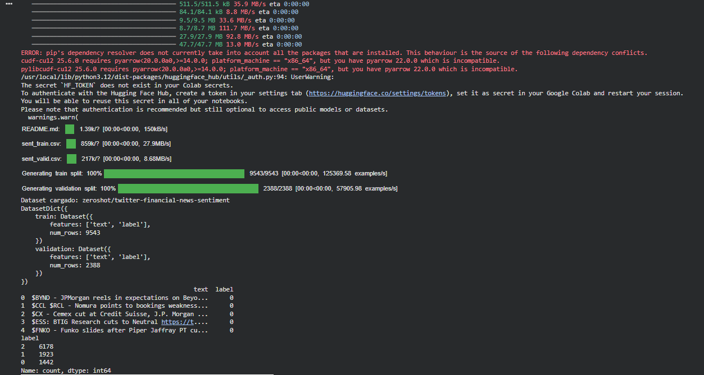
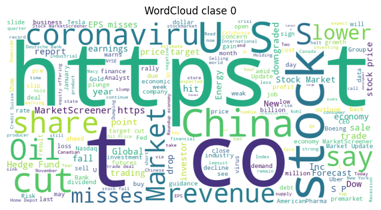
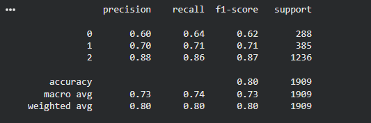
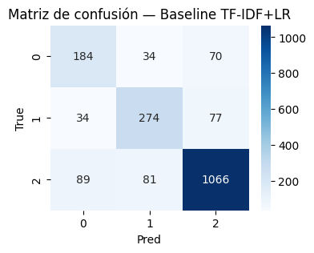
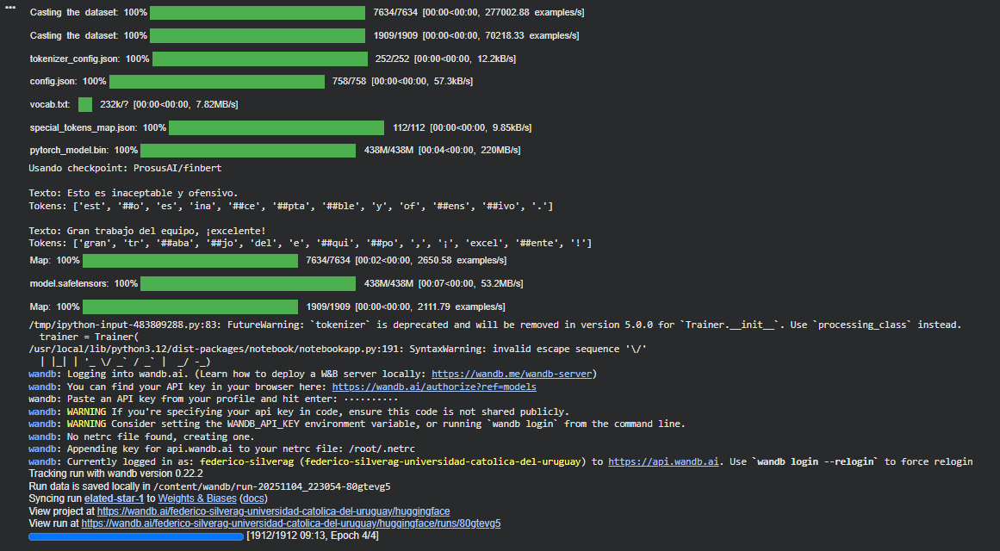
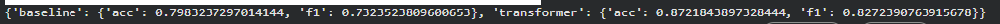

# De TF-IDF a FinBERT: cómo mejorar la detección de tono financiero con Transformers

En esta práctica se aplicó un proceso completo de *fine-tuning* sobre un modelo Transformer preentrenado (FinBERT) para la **clasificación de sentimiento en noticias financieras**, comparando su rendimiento con un modelo base clásico (TF-IDF + Logistic Regression).  
El trabajo siguió un flujo tipo **CRISP-DM**, pasando por exploración de datos, modelado, evaluación y análisis de resultados.

---

## Contexto
El desafío consistió en clasificar publicaciones financieras en Twitter según su tono: *Bearish* (negativo), *Bullish* (positivo) o *Neutral*.  
El dataset utilizado proviene de **Hugging Face** (`zeroshot/twitter-financial-news-sentiment`), con alrededor de **12 000 ejemplos en inglés**.  
El objetivo fue analizar qué tan bien un modelo clásico basado en representaciones TF-IDF podía capturar el sentimiento frente a un Transformer especializado en finanzas (FinBERT).

---

## Objetivos
- Comparar el desempeño de un modelo clásico (TF-IDF + Logistic Regression) frente a un modelo Transformer fine-tuneado (FinBERT).  
- Evaluar la **capacidad contextual y semántica** de los Transformers en tareas de sentimiento financiero.  
- Visualizar resultados y métricas clave (Accuracy y F1) a lo largo del entrenamiento.  
- Reflexionar sobre los costos de entrenamiento, ventajas y posibles mejoras futuras.

---

## Actividades (con tiempos estimados)

| Actividad | Tiempo | Resultado esperado |
|------------|:------:|--------------------|
| **Exploración del dataset y limpieza básica** | 30 min | Dataset normalizado y con análisis de longitudes y distribución de clases. |
| **EDA adicional (n-grams, WordCloud, TF-IDF-UMAP)** | 30 min | Identificación de patrones y ruido en vocabulario financiero. |
| **Entrenamiento del baseline (TF-IDF + LR)** | 25 min | Métricas base (Accuracy/F1) para comparar con el Transformer. |
| **Fine-tuning de FinBERT** | 40 min | Entrenamiento completo del modelo contextualizado. |
| **Visualización y comparación final** | 20 min | Curvas de métricas, comparación entre enfoques y conclusiones. |

---

## Desarrollo

Se inició con la **carga y normalización del dataset** financiero desde Hugging Face, verificando su balance de clases y longitud promedio.  
La exploración inicial mostró un claro **desbalance** (clase *Neutral* dominante) y textos cortos (~10–15 tokens), lo que permitió definir un `max_length` reducido para la tokenización.

En la **EDA adicional**, se analizaron los *n-grams* más frecuentes y nubes de palabras por clase, detectando ruido estructural (URLs, “https”, “co”) propio de tweets financieros. Se generaron también proyecciones PCA/UMAP con TF-IDF, observando un alto solapamiento entre clases, lo que justificó la necesidad de modelos contextuales.

El **baseline clásico (TF-IDF + Logistic Regression)** obtuvo una **accuracy del 80 %** y un **macro-F1 de 0.73**, mostrando que aunque capta patrones simples, falla en distinguir tonos similares (*bearish* vs *neutral*).

Luego, se aplicó *fine-tuning* del modelo **ProsusAI/FinBERT** con `learning_rate=2e-5`, `batch_size=16`, `epochs=4` y `weight_decay=0.01`.  
El modelo alcanzó una **accuracy de 0.87** y **F1 de 0.83**, mejorando significativamente al baseline (+0.10 en F1).  
Las curvas de validación mostraron convergencia estable y solo un leve aumento en *validation loss* tras la tercera época.

Finalmente, se compararon ambos métodos y se registraron los resultados visualmente: el Transformer mostró un salto claro en comprensión contextual y balance entre clases.

---

## Evidencias

???+ info "Evidencia 1: Carga y exploración del dataset"
    { width="640" }

???+ info "Evidencia 2: Distribución de longitudes"
    { width="480" }

???+ info "Evidencia 3: Distribución de clases"
    { width="420" }

???+ info "Evidencia 4: Top n-grams y WordClouds"
    { width="600" }

???+ info "Evidencia 5: Proyecciones TF-IDF (PCA y UMAP)"
    { width="420" }
    { width="420" }

???+ info "Evidencia 6: Baseline TF-IDF + Logistic Regression"
    { width="520" }
    { width="420" }

???+ info "Evidencia 7: Fine-tuning de FinBERT"
    { width="620" }
    { width="620" }

???+ info "Evidencia 8: Comparación final y métricas"
    { width="520" }
    { width="520" }

---

## Reflexión

- **Qué aprendí:**  
  Aprendí a comparar modelos clásicos de representación textual (TF-IDF + LR) con modelos basados en Transformers, entendiendo las ventajas del aprendizaje contextual.  
  Comprobé que el uso de un modelo especializado como **FinBERT** mejora significativamente la capacidad para detectar tono financiero, gracias a su entrenamiento previo en texto del mismo dominio.  

- **Qué mejoraría:**  
  Haría una limpieza más exhaustiva de los datos (remover URLs, símbolos bursátiles y duplicados) y exploraría *focal loss* o *class weighting* más ajustados para equilibrar las clases minoritarias.  
  También probaría **DistilBERT** o **TinyBERT** para lograr tiempos de inferencia más bajos en producción.

- **Próximos pasos:**  
  Implementar un pipeline de *inferencia en tiempo real* con **Hugging Face Inference API**, explorar el uso de **RAG** (Retrieval-Augmented Generation) para contextualizar mejor los tweets con noticias recientes, y desplegar un dashboard de monitoreo de métricas en producción.

---

## Referencias
- Dataset: [zeroshot/twitter-financial-news-sentiment](https://huggingface.co/datasets/zeroshot/twitter-financial-news-sentiment)  
- Modelo: [ProsusAI/FinBERT](https://huggingface.co/ProsusAI/finbert)  
- Documentación: [Hugging Face Transformers](https://huggingface.co/docs/transformers), [Scikit-learn Metrics](https://scikit-learn.org/stable/modules/classes.html#module-sklearn.metrics)
- Notebook de análisis: [Colab – Fine-tuning de Transformers para Clasificación Ofensiva (ES)](https://colab.research.google.com/drive/1tOmAaOF-jc4RSdWJv6STYEQ8pRTRedRw?usp=sharing)  
