# Dominar un LLM paso a paso: temperatura, ejemplos, estructuración y extracción

En esta práctica exploré cómo los modelos de lenguaje (LLM) cambian radicalmente su comportamiento según ajustes clave del prompt: temperatura, few-shot, formatos estructurados y extracción de información. A través de experimentos sistemáticos con LangSmith y Colab, pude observar cómo cada parámetro afecta la creatividad, estabilidad, precisión y consistencia del modelo. Además, integré técnicas como zero-shot vs few-shot, generación estructurada, extracción controlada y comparaciones entre plataformas.

---

## Contexto

El objetivo de esta práctica fue comprender, de forma experimental, cómo influye el *prompt engineering* en los resultados de un LLM. Esto incluyó:

- Evaluar cómo la **temperatura** afecta creatividad y estabilidad.
- Comparar **zero-shot** vs **few-shot**, especialmente en clasificación.
- Analizar cómo cambia la salida del modelo entre **LangSmith** y **Colab**, aun usando el mismo prompt y temperatura.
- Probar **generación estructurada**, produciendo salidas parseables para sistemas.
- Aplicar **extracción de información** usando un modelo con pydantic.
- Revisar además cómo los LLM responden cuando se pide poesía, resúmenes, definiciones, bullets y outputs técnicos.

---

## Objetivos

- Comprender cómo la **temperatura** modifica creatividad y variabilidad.
- Evaluar el impacto de **zero-shot** vs **few-shot** en tareas de clasificación.
- Observar diferencias de salida entre distintos **entornos de ejecución**.
- Producir **output estructurado** consistente usando modelos como GPT-4.1 / GPT-4o.
- Probar **extracción de datos** (title, fecha, entidades) a partir de texto libre.
- Analizar cómo los LLM responden a diferentes tipos de tareas: técnicas, poéticas, explicativas y resúmenes.

---

## Actividades (con tiempos estimados)

| Actividad | Tiempo | Resultado Esperado |
| :--- | :---: | :--- |
| **Pruebas con temperatura 0 vs 1** | 20 min | Comprender variabilidad creativa y estabilidad. |
| **Zero-shot vs few-shot** | 15 min | Comparar precisión y coherencia. |
| **Comparación LangSmith vs Colab** | 20 min | Verificar diferencias por plataforma. |
| **Generación estructurada** | 15 min | Producir JSON/bullets/objetos consistentes. |
| **Extracción de información** | 15 min | Convertir texto a objetos pydantic. |
| **Síntesis y experimentos secundarios** | 10 min | Conclusiones sobre comportamiento y sesgos. |

---

## Desarrollo

La práctica se abordó en módulos experimentales independientes:

### **1. Temperatura (0, 0.5, 1.0)**
Probé prompts simples (“hola, decime tu versión en una línea/3 líneas”).  
Encontré que:

- **Temperatura 0:** las respuestas fueron *idénticas* en múltiples ejecuciones.
- **Temperatura 1:** surgió creatividad, variación en redacción y cambios en precisión factual.
- **Temperatura 0.5:** equilibrio entre estabilidad y creatividad.

Además comparé el mismo prompt en **Colab** vs **LangSmith**, viendo que cada entorno agrega pequeñas diferencias por el *wrapper* y cómo manejan el contexto.

---

### **2. Zero-shot vs Few-shot**

Realicé clasificación de sentimiento con tres etiquetas (POS, NEG, NEU):

- En **zero-shot**, el modelo tendió a listar las etiquetas sin tomar una decisión.
- En **few-shot**, el modelo comenzó a seleccionar correctamente la etiqueta esperada.
- La calidad mejoró notablemente al incluir formatos explícitos (“Etiqueta: POS”).

Este experimento confirmó que el *few-shot* estabiliza comportamientos donde el modelo duda en zero-shot.

---

### **3. Haikus con distintas temperaturas**

Probé generar haikus sobre métricas, entrenamiento y sesgo.  
Con temperatura baja, los haikus fueron más secos y literales; con temperatura alta, más poéticos y variados.

---

### **4. Resúmenes estructurados**

Probé generar *bullets* con riesgos operativos de LLM.  
La salida fue consistente al pedir:

- `title`
- `bullets`
- listas bien formateadas  
- recomendaciones técnicas

Esto confirmó que *structured prompting* funciona muy bien para textos técnicos.

---

### **5. Comparación entre plataformas (Colab vs LangSmith)**

Ejecuté los mismos prompts en dos entornos.  
Aunque usaban el mismo modelo, aparecieron diferencias menores por:

- versión del wrapper,
- latencia
- temperatura efectiva (ligeras variaciones)

Esto refuerza que para producción conviene fijar *entorno, wrapper y versión exacta*.

---

### **6. Extracción con Pydantic**

Implementé un modelo `ExtractInfo` con título obligatorio, fecha y entidades.  
El modelo extrajo:

- Fechas en distintos formatos  
- Entidades tipo ORG, LOC  
- Títulos incluso cuando el texto no presentaba uno explícito

En pruebas complejas (como múltiples fechas o textos ambiguos) el extractor siguió funcionando bien después de ajustar el campo título como obligatorio.

---

## Evidencias

Las siguientes capturas muestran los resultados representativos de los experimentos.

???+ info "Temperatura en Colab (0 y 1)"
    
    

???+ info "Temperatura en LangSmith (0 y 1)"
    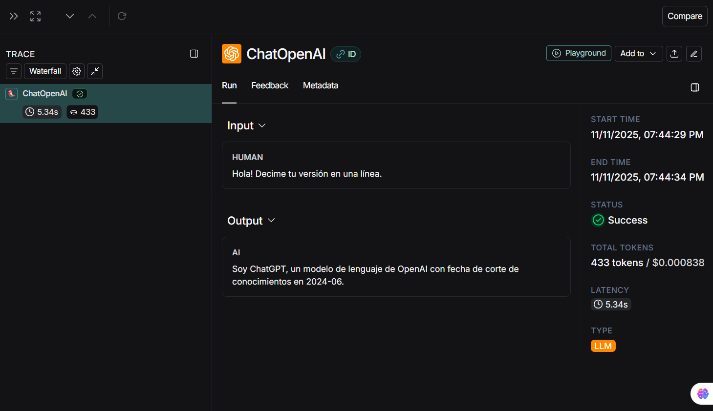
    

???+ info "Comparación 3 líneas — Colab y LangSmith"
    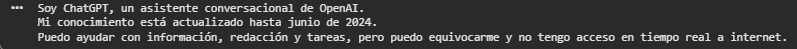
    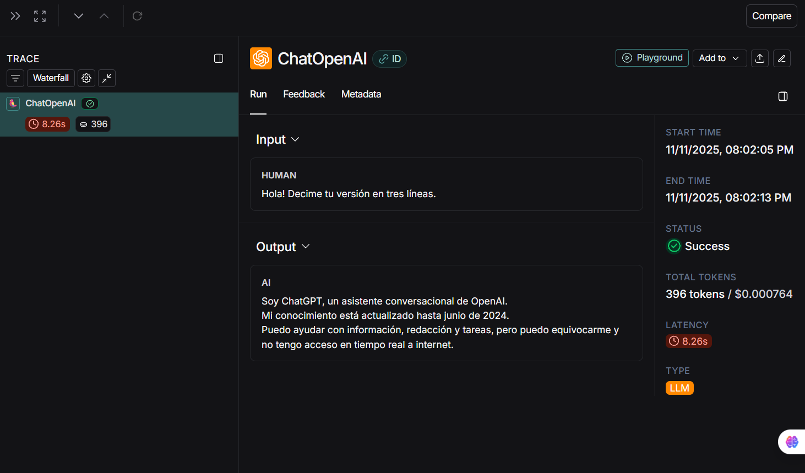
    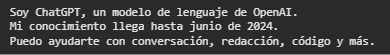
    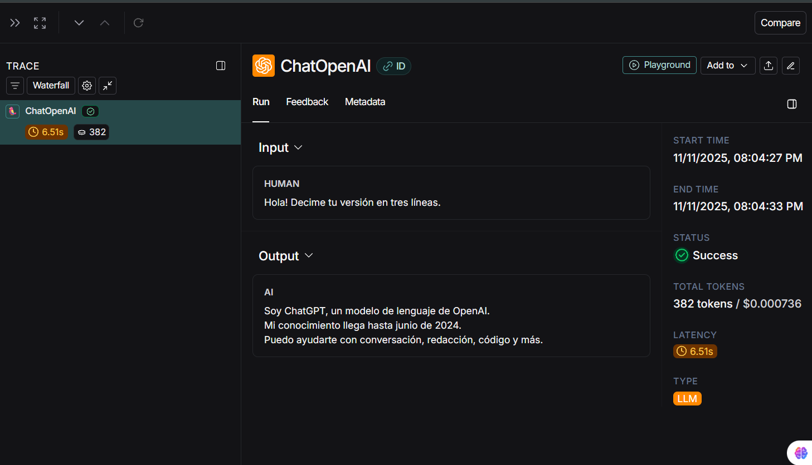

???+ info "Comparación de respuestas con temperatura variable"
    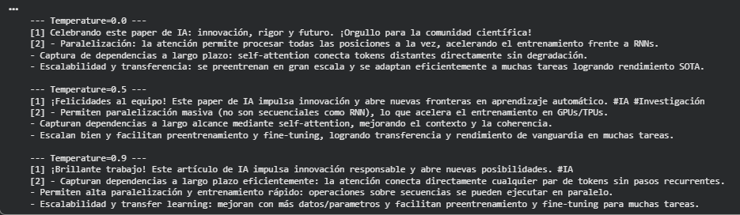

???+ info "Haikus (temp 0, 0.5, 0.9)"
    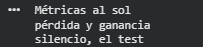
    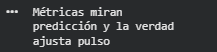
    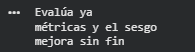

???+ info "Zero-shot vs Few-shot"
    
    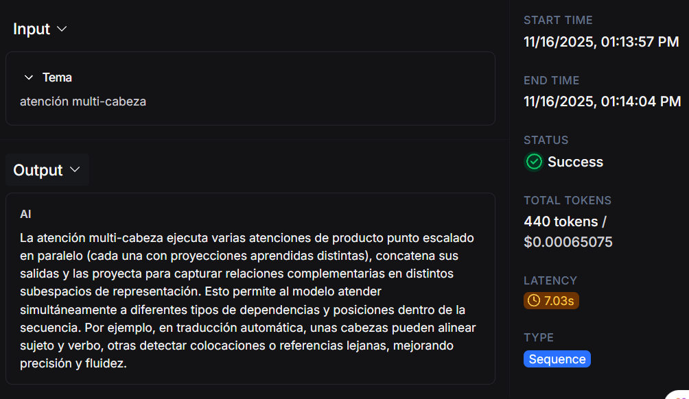
    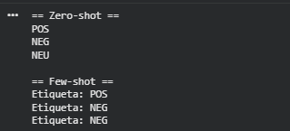
    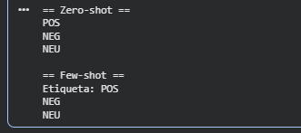
    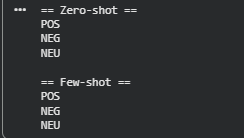

???+ info "Structured output"
    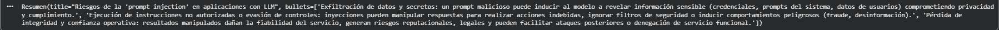

???+ info "Experimentos adicionales"
    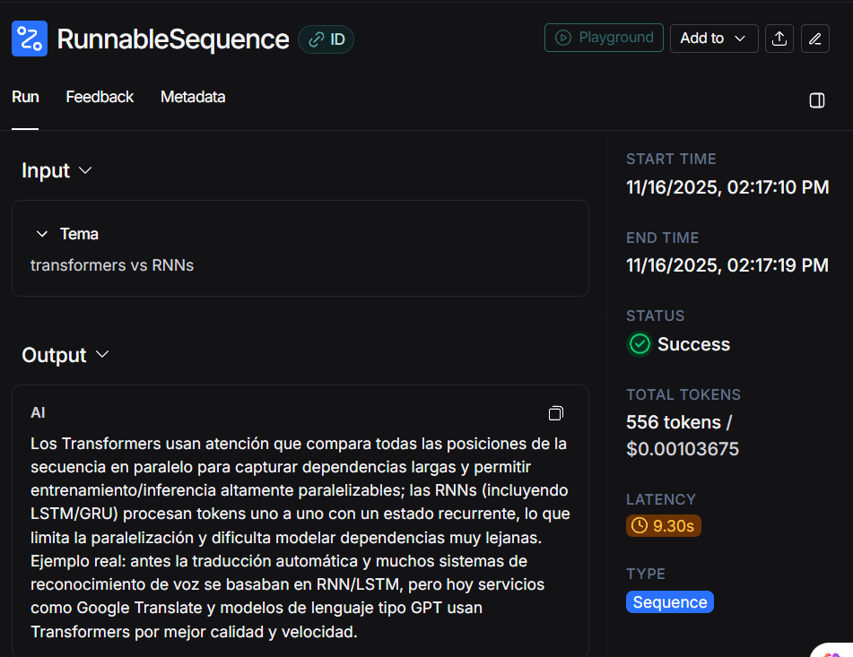
    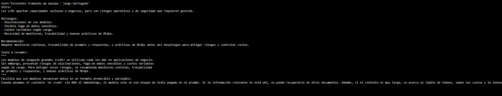

???+ info "Hello LLM"
    
    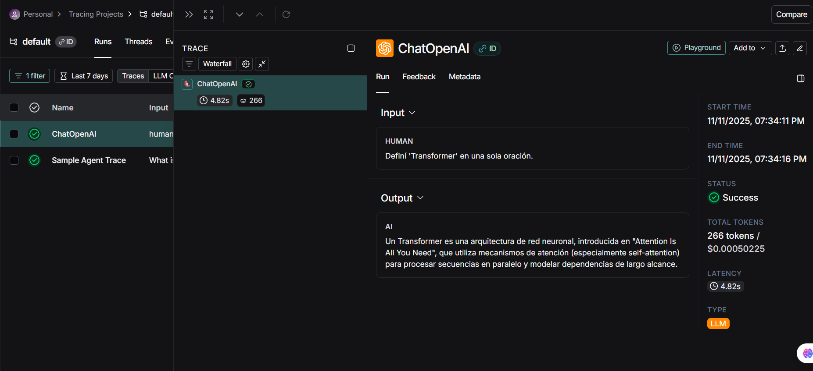

---

## Reflexión

- **Qué aprendí:**  
  Entendí cómo los parámetros del prompt (especialmente temperatura y ejemplos) influyen directamente en la estabilidad del modelo. También confirmé que el *structured prompting* es esencial cuando se necesita salida confiable para sistemas, y que la extracción con Pydantic funciona muy bien si el esquema está bien definido. Además, pude comprobar diferencias reales entre ejecutar un prompt en diferentes entornos.

- **Qué mejoraría:**  
  En futuras pruebas incorporaría *RAG* y bases vectoriales para ver cómo cambian las respuestas cuando el LLM tiene acceso a contexto recuperado. También evaluaría varias temperaturas intermedias y más ejemplos en few-shot para medir sensibilidad.

- **Próximos pasos:**  
  Integrar mecanismos de evaluación automática (métricas, trazabilidad con LangSmith), probar agentes y pipelines más complejos, y comenzar a combinar estos conceptos con casos reales de producción.

---

## Referencias

- Notebook de análisis:  
  https://colab.research.google.com/drive/1AT6A4o41_r4SAjvO8PIhOlq2RBYsa9e9?usp=sharing

- Documentación de modelos y herramientas:  
  - OpenAI API Docs  
  - LangChain / LangSmith  
  - Pydantic schemas  
  - Ejemplos de structured prompting  
