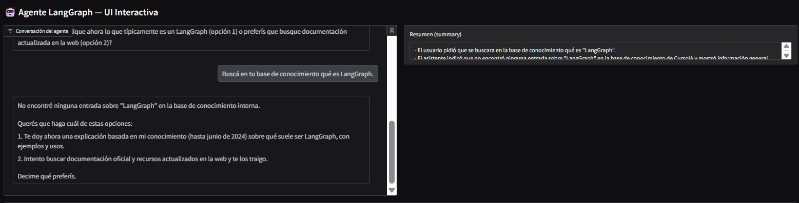
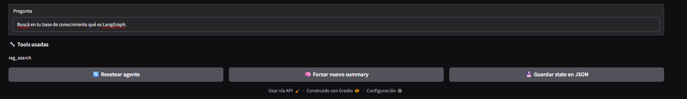
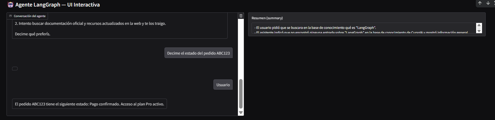
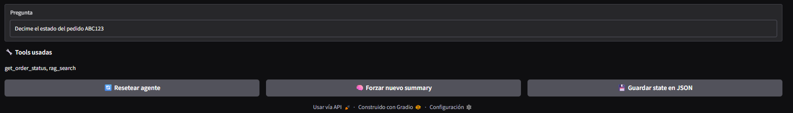

# Construyendo un agente de soporte inteligente: de RAG a herramientas dinámicas con LangGraph

En esta práctica integré **RAG**, **herramientas personalizadas**, **LangGraph** y **memoria ligera**, construyendo un agente capaz de:

- Buscar información en una base de conocimiento (RAG).
- Consultar datos de usuario mediante tools estructuradas.
- Mantener el contexto entre turnos.
- Combinar la información de RAG + tools dentro de una misma conversación.
- Visualizar el flujo del agente desde una UI interactiva en Gradio.

---

## Contexto
El objetivo fue diseñar un agente que pudiera responder preguntas sobre un producto ficticio (**CursoIA**) y también consultar información de usuario vía tools, todo coordinado desde un grafo LangGraph con memoria ligera.

## Objetivos
- Construir un estado del agente con `messages` y `summary`.
- Implementar un mini‑RAG local.
- Crear las tools `rag_search` y `get_order_status`.
- Armar el grafo LangGraph completo.
- Probar conversaciones multiturno y registrar herramientas usadas.
- Documentar el proceso.

## Actividades (con tiempos estimados)

| Actividad | Tiempo | Resultado Esperado |
|----------|--------|--------------------|
| Dataset RAG | 20 min | Base indexada |
| Tools | 20 min | Tools operativas |
| Grafo LangGraph | 40 min | Flujo multiturno |
| UI en Gradio | 30 min | Pruebas interactivas |
| Informe | 20 min | Documento final |

---

# Desarrollo

## 1. Estado del agente
```python
class AgentState(TypedDict):
    messages: Annotated[list, operator.add]
    summary: Optional[str]
```

## 2. Mini‑RAG
Se creó un corpus de 6–8 textos breves explicando CursoIA, sus planes y FAQs de ML/DL, indexado con FAISS.

## 3. Tools
### 🟦 rag_search
Busca documentos relevantes en la base vectorial.

### 🟩 get_order_status
Devuelve estados ficticios de suscripciones:
- ABC123 → Pago confirmado
- XYZ999 → Suscripción vencida

## 4. Grafo LangGraph
Estructura general:
```
assistant → tools → assistant → memory → assistant
```

## 5. Conversaciones probadas

- **Convo 1:** Preguntas sobre producto → usa RAG.  
- **Convo 2:** Estado de una suscripción → usa tool.  
- **Convo 3:** Conversación mixta multiturno → usa ambas.

---

# Evidencias

???+ info "Evidencia 1 — Agente respondiendo sobre LangGraph"
    > Respuesta 1: LangGraph es un framework para diseñar y orquestar agentes de IA como grafos de estado: cada nodo representa un paso (prompt, llamada a API, acción o verificación) y las aristas controlan el flujo según condiciones. Facilita construir, visualizar y depurar flujos complejos (incluye soporte para RAG y se integra con OpenAI, Hugging Face, LangChain, etc.). ¿Quieres un ejemplo rápido o cómo aplicarlo a tu caso?

???+ info "Evidencia 2 — Conversación 1 (producto) — uso de RAG"
    ```
    === Conversación 1 (producto) - Mensajes ===
    [Human] ¿Qué es CursoIA y qué diferencia hay entre el plan Básico y el Pro?
    [Tool] Documentos recuperados sobre planes y diferencias.
    [AI] Respuesta con comparación completa.
    Tools usadas: ['rag_search']
    ```

???+ info "Evidencia 3 — Conversación 3 (producto + estado) — RAG + tool"
    ```
    === Conversación 3 - Turno 1 ===
    RAG recomienda planes de Deep Learning.
    === Turno 2 ===
    [Tool] Estado XYZ999: Suscripción vencida. Pendiente de renovación.
    Tools usadas: ['get_order_status', 'rag_search']
    ```

???+ info "Evidencia 4 — UI en Gradio funcionando"
    
    
    

    
    

---

# Reflexión

### Qué aprendí
- A combinar RAG + tools + memoria dentro de un grafo.
- Cómo LangGraph gestiona flujos complejos de reasoning.
- Por qué un agente puede decidir automáticamente qué herramienta usar.

### Qué mejoraría
- Router más explícito para evitar ambigüedad.
- Persistencia real en un backend.
- Reemplazar FAISS local por vector store externo.

### Próximos pasos
- Integrar APIs reales.
- Mejorar la memoria conversacional.
- Extender este agente a un chatbot de soporte completo para un SaaS.

---

# Referencias

- Notebook: https://colab.research.google.com/drive/1JkOGbX4KJPFyBvbipVQBZXchj-TlRBxa?usp=sharing
- LangGraph Docs: https://langchain-ai.github.io/langgraph/
- Tutorial RAG: https://python.langchain.com/docs/tutorials/rag/
- OpenAI Tools: https://platform.openai.com/docs
