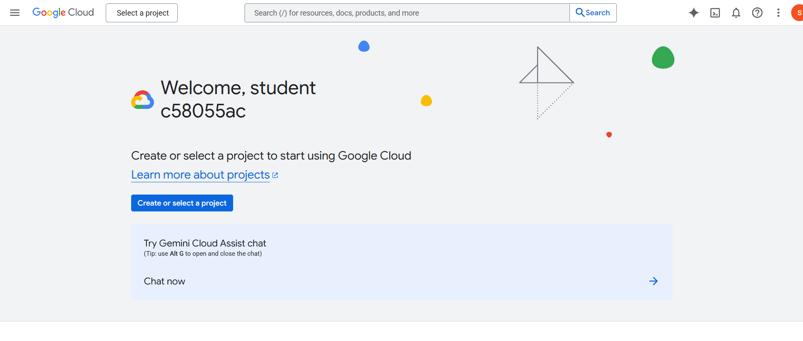
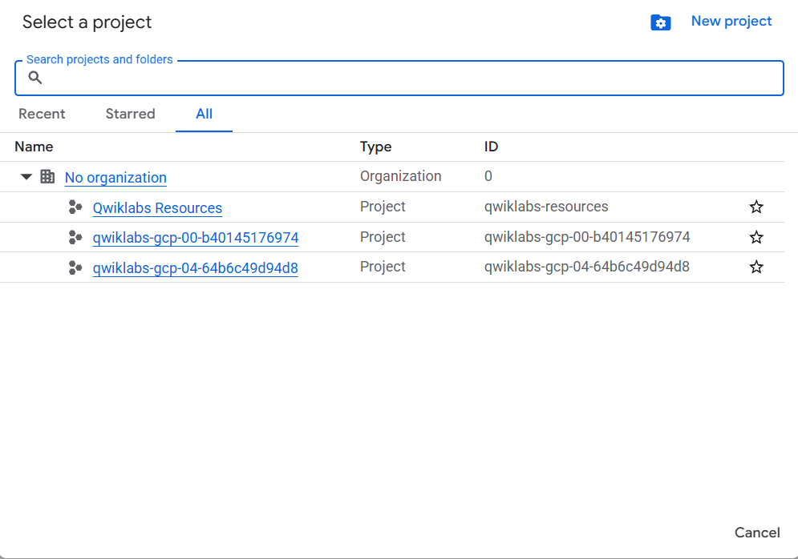
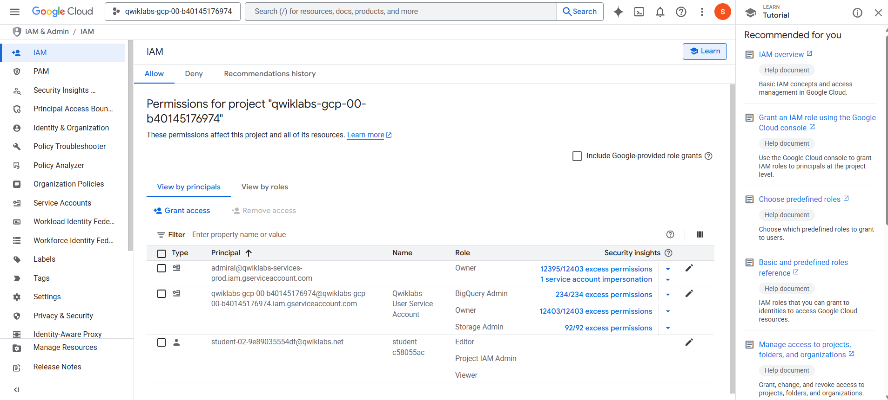
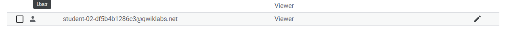
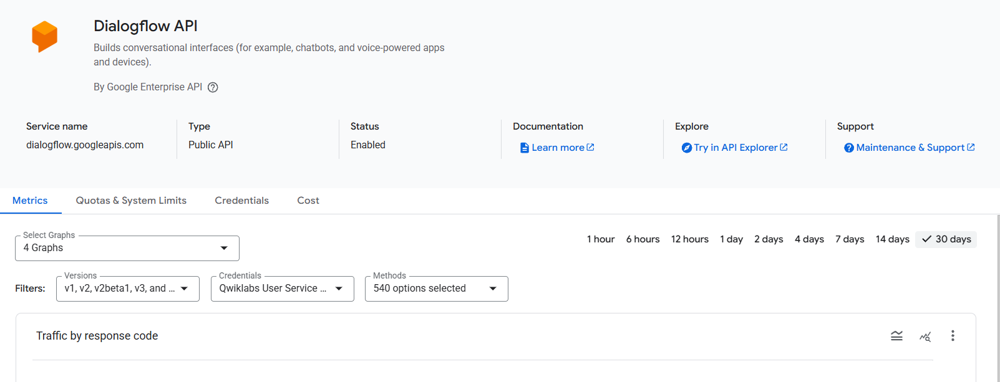

# Primeros pasos en Google Cloud: gestionando proyectos, permisos y APIs

En este laboratorio introductorio, exploré por primera vez la **consola de Google Cloud**, aprendiendo a navegar la plataforma, administrar proyectos, trabajar con permisos mediante **Cloud IAM**, habilitar APIs y comprender cómo funcionan los entornos temporales que ofrece Google Cloud Skills Boost.  
Este lab sentó las bases para entender cómo se estructura y administra cualquier solución en Google Cloud.

---

## Contexto

Google Cloud ofrece una amplia variedad de servicios de computación, almacenamiento, redes e inteligencia artificial.  
Los labs de Google Cloud Skills Boost proporcionan entornos temporales, con proyectos preconfigurados para practicar de forma segura.

En este ejercicio aprendí:

- Cómo acceder correctamente con credenciales temporales y evitar mezclar cuentas personales.
- Qué es un proyecto de Google Cloud y cómo identificar sus elementos clave.
- Cómo navegar servicios usando el menú principal.
- Cómo inspeccionar y otorgar permisos con IAM.
- Cómo habilitar APIs fundamentales y dónde consultar su documentación.

---

## Objetivos

- Acceder a un entorno temporal de Google Cloud y explorar la consola web.
- Identificar los elementos clave del panel del lab: usuario, proyecto, tiempo, créditos.
- Examinar proyectos disponibles y comprender la diferencia entre uno temporal y **Qwiklabs Resources**.
- Navegar por los servicios usando el menú lateral de Google Cloud.
- Revisar y modificar permisos mediante IAM.
- Habilitar una API (Dialogflow) desde la biblioteca de APIs y explorar su documentación.

---

## Actividades (con tiempos estimados)

| Actividad | Tiempo | Resultado Esperado |
|----------|:------:|---------------------|
| Acceso al entorno y credenciales | 5 min | Acceso seguro a la consola del lab |
| Exploración de proyectos | 5 min | Identificación del proyecto temporal y Qwiklabs Resources |
| Revisión de IAM | 10 min | Comprensión de roles y permisos asignados |
| Otorgamiento de rol Viewer | 5 min | IAM configurado con un nuevo principal |
| Habilitación de Dialogflow API | 5 min | API habilitada y documentación revisada |
| Evaluación final de conceptos | 5 min | Validación del aprendizaje del lab |

---

## Desarrollo

El laboratorio comenzó accediendo a la consola de Google Cloud mediante credenciales temporales proporcionadas por Qwiklabs.  
Luego identifiqué el proyecto activo asignado para el lab y exploré los proyectos disponibles, incluyendo **Qwiklabs Resources**, un proyecto compartido en modo lectura.

A continuación utilicé el menú de navegación lateral para familiarizarme con las diferentes categorías de servicios como Compute, Storage, Operations, IAM y más.

En la sección de IAM revisé los permisos otorgados al usuario del lab, verificando que contaba con el rol básico **Editor**, y luego otorgué un nuevo rol **Viewer** a un usuario ficticio siguiendo los pasos del lab.

Finalmente, desde la Biblioteca de APIs habilité la API de Dialogflow para este proyecto y accedí a su documentación oficial para explorar sus endpoints y casos de uso.

---

## Evidencias

???+ info "👉 Evidencia 1: Acceso a la consola"
    { width="700" }

???+ info "👉 Evidencia 2: Selector de proyectos"
    { width="700" }

???+ info "👉 Evidencia 3: Roles iniciales de IAM"
    { width="700" }

???+ info "👉 Evidencia 4: Rol Viewer otorgado"
    { width="700" }

???+ info "👉 Evidencia 5: API Dialogflow habilitada"
    { width="700" }

---

## Reflexión

**Qué aprendí:**  
Este laboratorio me permitió entender la estructura fundamental de Google Cloud: cómo funcionan los proyectos, cómo se administran los accesos con IAM y por qué las APIs deben habilitarse explícitamente. También comprendí el flujo de trabajo del entorno temporal de Qwiklabs y la importancia de usar siempre la cuenta asignada para evitar conflictos.

**Qué mejoraría:**  
Podría explorar con mayor profundidad cómo se comportan los roles avanzados o específicos por servicio y habilitar varias APIs para relacionar dependencias entre ellas.

**Próximos pasos:**  
Realizar labs más avanzados que incluyan Cloud Shell, creación de máquinas virtuales, redes y, más adelante, Vertex AI, orquestación de pipelines y despliegue de modelos.

---

## Referencias

- Google Cloud Documentation – https://cloud.google.com/docs  
- Qwiklabs / Google Cloud Skills Boost  
- IAM Roles Overview – https://cloud.google.com/iam/docs/understanding-roles  
- Dialogflow API – https://cloud.google.com/dialogflow/es/docs/apis-overview  

