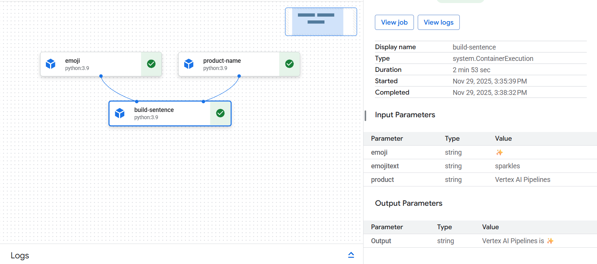
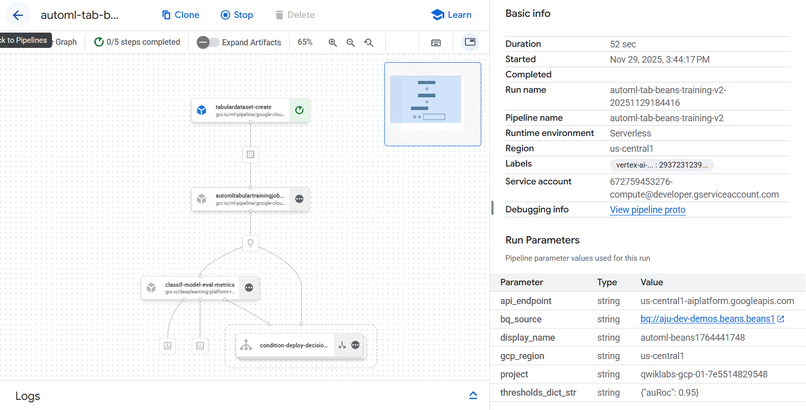
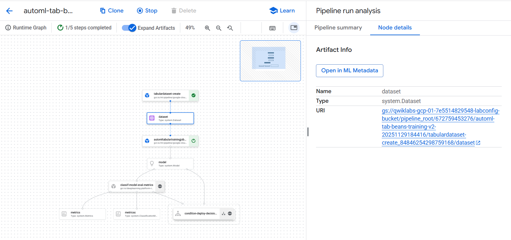
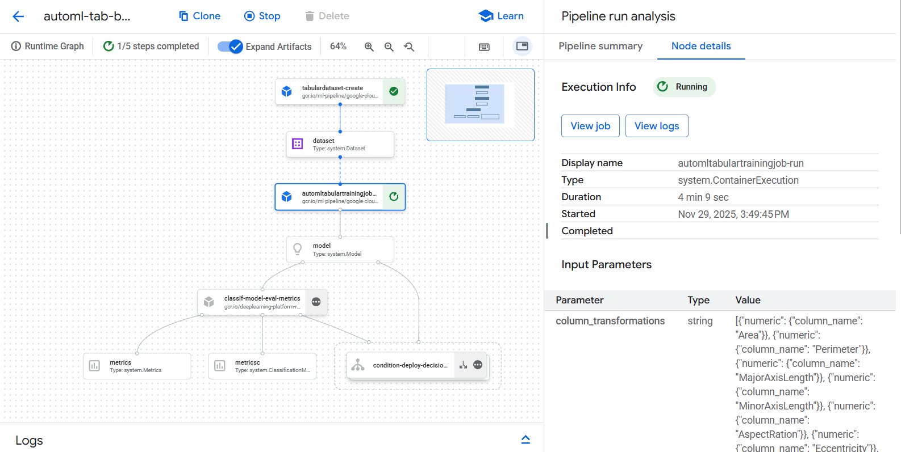

# De datos crudos a modelo desplegado: construyendo un pipeline de ML con AutoML y Vertex AI

En esta práctica trabajé con **Vertex AI Pipelines**, la herramienta de Google Cloud diseñada para automatizar flujos de Machine Learning. El desafío consistió en construir un pipeline completo que va desde datos crudos hasta la creación, evaluación y potencial despliegue de un modelo entrenado con AutoML.  
A lo largo del proceso aprendí a combinar componentes personalizados, servicios nativos de Vertex AI y BigQuery para crear una solución reproducible, escalable y alineada al ciclo **CRISP-DM**.

---

## Contexto

En proyectos reales, un modelo no se entrena solo una vez. Se necesitan procesos **automáticos**, **repetibles** y **modulares**, especialmente cuando se trabaja con datos que evolucionan. Vertex AI Pipelines resuelve este problema permitiendo definir flujos de ML como código, controlando datos, artefactos y dependencias entre pasos.

El objetivo de este laboratorio fue simular un pipeline profesional que:

1. Recibe datos tabulares,
2. Crea un dataset en Vertex AI,
3. Entrena un modelo AutoML de clasificación,
4. Evalúa métricas y toma decisiones automáticas,
5. Y opcionalmente despliega el modelo en un endpoint si cumple un umbral de calidad.

Este ejercicio forma parte de mi formación en Inteligencia Artificial, integrando habilidades de MLOps, AutoML y orquestación de pipelines en la nube.

---

## Objetivos

- Construir componentes personalizados con el SDK de Kubeflow Pipelines.
- Conectar componentes usando artefactos y dependencias declaradas.
- Configurar e iniciar un pipeline simple de introducción.
- Crear un pipeline completo de AutoML Tabular (dataset → entrenamiento → evaluación → despliegue).
- Analizar artefactos generados en Vertex AI (datasets, modelos, métricas).
- Comprender cómo automatizar decisiones basadas en umbrales de desempeño.

---

## Actividades (con tiempos estimados)

| Actividad | Tiempo | Resultado Esperado |
|----------|:------:|--------------------|
| Configuración del entorno | 10 min | Notebook funcionando con dependencias instaladas |
| Pipeline introductorio (hello-world) | 15 min | Pipeline funcional con tres componentes |
| Construcción del dataset en Vertex AI | 10 min | Artefacto `system.Dataset` creado desde BigQuery |
| Entrenamiento con AutoML | 20 min | Job iniciado correctamente (entrenamiento demora ~1h) |
| Evaluación y lógica condicional | 10 min | Componente personalizado ejecutándose |
| Revisión de artefactos y reflexión | 10 min | Entendimiento del flujo completo |

---

## Desarrollo

### 1. Preparación del entorno

Comencé en Vertex AI Workbench y configuré todas las librerías necesarias (KFP, google-cloud-aiplatform, pipeline components).  
Luego definí variables del proyecto, bucket de almacenamiento y región, asegurando que todos los componentes del pipeline pudieran escribir artefactos en Cloud Storage.

---

### 2. Pipeline introductorio: “hello-world”

Antes de pasar a AutoML construí un pipeline sencillo formado por tres componentes:

- `product_name`: recibe un string.
- `emoji`: convierte un texto en un emoji.
- `build_sentence`: combina los resultados y arma una frase final.

El pipeline ejecutó correctamente y generó:

**Salida final:** `Vertex AI Pipelines is ✨`

Esta primera parte me permitió entender:
- cómo escribir componentes como funciones Python,
- cómo declarar entradas y salidas,
- cómo compilar y ejecutar un pipeline en Vertex AI.

---

### 3. Pipeline de AutoML: datos crudos → modelo

El pipeline principal incluyó cinco pasos:

1. **TabularDatasetCreateOp**  
   Crea un dataset desde BigQuery.

2. **AutoMLTabularTrainingJobRunOp**  
   Entrena un modelo AutoML de clasificación multiclase sobre el dataset “Dry Beans”.

3. **Componente personalizado de evaluación**  
   Extrae métricas, renderiza matriz de confusión y curva ROC, y decide si el modelo es lo suficientemente bueno.

4. **Condición (dsl.Condition)**  
   Si el métrico AUC supera 0.95 → se despliega el modelo.

5. **ModelDeployOp**  
   Despliega el modelo en un endpoint (solo si pasa la condición).

---

### 4. Ejecución del pipeline

La ejecución se inició correctamente, y los primeros pasos se completaron antes de que se cerrara la sesión del laboratorio.  
El entrenamiento de AutoML empezó a correr (este paso demora alrededor de 1 hora y es normal que continúe ejecutándose más allá de la sesión del lab).

Logré capturar evidencias del DAG completo, del dataset creado y del inicio del entrenamiento.

---

## Evidencias

### 👉 Evidencia 1: Pipeline introductorio funcionando  
    { width="700" }

### 👉 Evidencia 2: DAG de la pipeline de AutoML  
    { width="700" }

### 👉 Evidencia 3: Artefacto dataset creado correctamente  
    { width="700" }

### 👉 Evidencia 4: Entrenamiento AutoML en ejecución  
    { width="700" }

Estas evidencias demuestran que el pipeline se inició de forma completa y que Vertex AI está gestionando todos los pasos correctamente.

---

## Reflexión

Esta práctica me permitió ver en acción cómo se **industrializan** los modelos de Machine Learning en la nube.  
Lo más relevante que aprendí:

- Una pipeline bien diseñada permite **repetibilidad** y **escalabilidad**, evitando procesos manuales.
- AutoML simplifica la experimentación, pero sigue siendo fundamental entender cómo orquestar datos, entrenamiento y despliegue.
- Los artefactos generados por Vertex AI permiten rastrear el linaje completo del sistema (datasets, modelos, métricas, endpoints).
- Usar lógica condicional dentro de un pipeline ayuda a automatizar decisiones sin intervención humana.

### Qué mejoraría
- Incorporar notificaciones automáticas (Pub/Sub o Cloud Functions) para saber cuándo termina el entrenamiento.
- Añadir evaluaciones adicionales (por ejemplo, costo de confusión o métricas por clase).

### Próximos pasos
- Crear pipelines más complejos usando TFX.
- Integrar validación de datos con TensorFlow Data Validation.
- Probar pipelines con scheduling desde Cloud Scheduler.

---

## Referencias

- Google Cloud – Vertex AI Documentation  
- Google Cloud – Kubeflow Pipelines SDK  
- “Dry Beans Dataset”, UCI Machine Learning Repository  
- Material del laboratorio de Google Cloud Skills Boost

